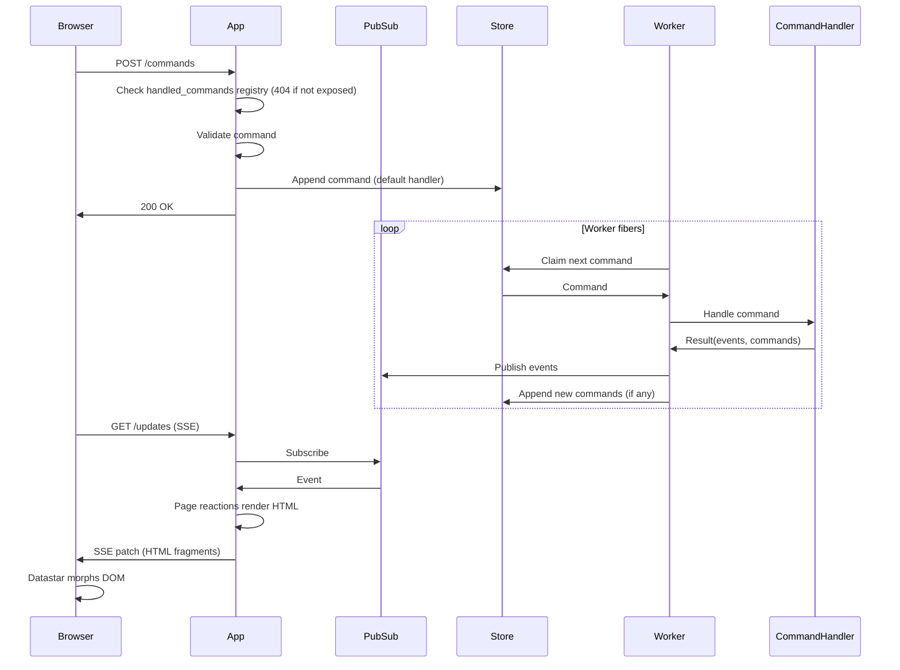

# Sidereal

A Ruby gem for building server-driven reactive web applications. Sidereal combines a Rack-compatible trie-based router with an event-driven architecture using typed messages, commands, pages, and pub/sub. The server pushes HTML updates to the browser via SSE -- no client-side JS framework needed.

Built on [Datastar](https://data-star.dev/) (SSE streaming), [Phlex](https://www.phlex.fun/) (HTML rendering), [Plumb](https://github.com/ismasan/plumb) (typed data), [Async](https://github.com/socketry/async) (fiber concurrency). Designed to run on [Falcon](https://github.com/socketry/falcon).

## Installation

Add to your Gemfile:

```bash
bundle add sidereal
```

Or install directly:

```bash
gem install sidereal
```

## Quick start

A Sidereal app has three main parts: **commands** (typed data), **command handlers** (state changes), and **pages** (reactive UI).

```ruby
require 'sidereal'

# 1. Define command messages
AddTodo = Sidereal::Message.define('todos.add') do
  attribute :title, Sidereal::Types::String.present
end

# 2. Define a page
class TodoPage < Sidereal::Page
  path '/'

  # React to events by pushing HTML updates via SSE
  on AddTodo do |evt|
    browser.patch_elements load(params)
  end

  def self.load(_params, _ctx)
    new(todos: TODOS.values)
  end

  def initialize(todos: [])
    @todos = todos
  end

  def view_template
    div do
      # An Ajax form to dispatch a command to the backend 
      command AddTodo do |f|
        f.text_field :title, placeholder: 'What needs to be done?'
        button(type: :submit) { 'Add' }
      end

      ul do
        @todos.each { |t| li { t.title } }
      end
    end
  end
end

# 3. Wire it up in an App
TODOS = {}

class TodoApp < Sidereal::App
  session secret: ENV.fetch('SESSION_SECRET')

  # Expose AddTodo to the browser's POST /commands
  handle AddTodo

  # Register the async worker handler
  command AddTodo do |cmd|
    TODOS[cmd.id] = cmd.payload
  end

  page TodoPage
end
```

## Commands

Commands are typed, immutable data objects defined with `Message.define`. Each message has an auto-generated UUID, a type string, timestamps, metadata, and a typed payload.

```ruby
AddTodo = Sidereal::Message.define('todos.add') do
  attribute :todo_id, Sidereal::Types::AutoUUID
  attribute :title, Sidereal::Types::String.present
end

RemoveTodo = Sidereal::Message.define('todos.remove') do
  attribute :todo_id, Sidereal::Types::UUID::V4
end

Notify = Sidereal::Message.define('todos.notify') do
  attribute :message, String
end
```

Commands use dot-separated type strings (e.g. `'todos.add'`) for registry lookup and serialization. Payload attributes are validated using [Plumb](https://github.com/ismasan/plumb) types.

```ruby
cmd = AddTodo.new(payload: { title: 'Buy milk' })
cmd.id              # => "a1b2c3d4-..."
cmd.type            # => "todos.add"
cmd.payload.title   # => "Buy milk"
cmd.created_at      # => 2026-03-26 10:00:00 +0000
```

### Correlation chain

Commands maintain a causation/correlation chain for traceability:

```ruby
event = source_cmd.correlate(SomeEvent.new(payload: { ... }))
event.causation_id    # => source_cmd.id
event.correlation_id  # => source_cmd.correlation_id
```

## App

`Sidereal::App` is a web router with that implements a full reactive framework: command handlers, pages, layouts, and SSE streaming. It automatically sets up `POST /commands` and `GET /updates/:channel_name` endpoints.

```ruby
class ChatApp < Sidereal::App
  session secret: ENV.fetch('SESSION_SECRET')
  layout ChatLayout

  # SendMessage is submitted from the browser
  # Use .handle to white-list this command in the HTTP endpoint
  handle SendMessage

  # Incoming command is dispatched to a background fiber,
  # and handled by this block
  # The block can optional #dispatch a new command in a workflow
  command SendMessage do |cmd|
    MessageLog.append(cmd)
    dispatch Notify, message: "#{cmd.payload.author}: #{cmd.payload.content}"
  end

  # Notify is dispatched internally and never exposed to the web
  command Notify do |cmd|
    # no-op, but events from this command will still be published
  end

  # Mount a page to be served on ChatPage.path
  page ChatPage
end
```

### Commands

Commands are split into two registrations:

- `command` registers an async handler with the app's `Commander`. Worker fibers pick the command off the store and run this block. Commands registered *only* via `command` are **internal** — they can be produced by other handlers, automations, or sagas, but cannot be submitted from the browser.
- `handle` exposes a command to `POST /commands` (see [Custom command handlers](#custom-command-handlers)). Any type that isn't `handle`-registered returns `404` on POST.

Inside a `command` block, use `dispatch` to produce events or enqueue follow-up commands.

```ruby
# Internal command — dispatched from other handlers, never from the browser
SendEmail = Sidereal::Message.define('mail.send') { attribute :to, String }

command SendEmail do |cmd|
  Mailer.deliver(cmd.payload.to)
end

# Web-facing command — exposed via `handle`, processed async via `command`
handle AddTodo

command AddTodo do |cmd|
  TODOS[cmd.payload.todo_id] = cmd.payload

  # Dispatching a registered command type enqueues it for processing
  dispatch SendEmail, to: 'user@example.com'

  # Dispatching any other message type produces a transient event
  dispatch Notify, message: "Added: #{cmd.payload.title}"
end
```

### Broadcast

Use `broadcast` inside a command handler to publish a message immediately to the SSE stream, without waiting for the command to finish processing. Useful for progress indicators.

```ruby
command AskLLM do |cmd|
  broadcast Working  # immediately tells the UI "thinking..."

  response = llm.ask(cmd.payload.content)
  dispatch SendMessage, author: 'Bot', content: response.content
end
```

### Command helpers

Define helper methods available inside command handlers:

```ruby
class ChatApp < Sidereal::App
  command_helpers do
    private def chat
      @chat ||= RubyLLM.chat
    end
  end

  command AskLLM do |cmd|
    response = chat.ask(cmd.payload.content)
    dispatch SendMessage, author: 'Bot', content: response.content
  end
end
```

### Custom command handlers

`handle` declares which commands the browser is allowed to submit to `POST /commands`. Types not registered with `handle` return `404`.

`handle` accepts one or more command classes. Called without a block, it installs the default handler: validate the command, append it to the async store, and return `200`. Worker fibers then pick it up and run the matching `command` block.

```ruby
class TodoApp < Sidereal::App
  # Expose multiple commands at once with the default handler
  handle AddTodo, RemoveTodo

  command AddTodo do |cmd|  # async worker handler
    TODOS[cmd.payload.todo_id] = cmd.payload
  end
end
```

Pass a block to `handle` to process the command **synchronously** during the HTTP request instead — useful for lightweight mutations, or when you want to stream DOM updates back to the browser immediately:

```ruby
handle AddTodo do |cmd|
  TODOS[cmd.id] = cmd.payload.to_h
  browser.patch_elements TodoList.new(TODOS.values)
end
```

A custom `handle` block replaces the default async-dispatch behaviour. If you still want the async worker to run, call `dispatch(cmd)` inside the block.

```ruby
handle AddTodo do |cmd|
  browser.patch_elements %(<p id="notification">Processing...</p>)
  dispatch(cmd) # <= schedule command for background processing
end
```


`handle` does **not** register the command with the async `Commander`. To have a web-submitted command also processed by workers, pair `handle` with a `command` block as shown above.

Inside a `handle` block you have access to:

- `browser` — the SSE stream for pushing DOM updates (see [SSE reactions](#sse-reactions) for the full API)
- `dispatch(MessageClass, payload)` — correlate and append a follow-up command to the async store
- `patch_command_errors(errors)` — stream field-level validation errors back to the form
- `store`, `pubsub`, `params`, `session` — the usual App instance helpers

#### Streaming DOM updates

When the browser submits a command via Datastar (the default), the request accepts SSE responses. The `handle` block can use `browser` to push HTML patches, signal updates, or JavaScript execution — just like page `on` reactions:

```ruby
handle AddTodo do |cmd|
  TODOS[cmd.id] = cmd.payload.to_h

  browser.patch_elements TodoList.new(TODOS.values)
end
```

`browser` is an alias for the Datastar dispatcher — each call above produces a one-off SSE event. For multi-step, real-time updates over a single request, use `browser.stream { |sse| ... }`:

```ruby
handle GenerateReport do |cmd|
  browser.stream do |sse|
    sse.patch_elements %(<div id="status">Working...</div>)
    expensive_work do |progress|
      sse.patch_signals progress: progress
    end
    sse.patch_elements %(<div id="status">Done</div>)
  end
end
```

The `handle` block runs synchronously before any SSE streaming starts, so `session[:x] = …` writes inside it commit to the session cookie as expected.

#### Dispatching follow-up commands

Use `dispatch` to enqueue a command for async processing. The dispatched command is automatically correlated to the source command:

```ruby
handle AddTodo do |cmd|
  TODOS[cmd.id] = cmd.payload.to_h
  browser.patch_elements TodoList.new(TODOS.values)
  dispatch NotifyUser, text: "Todo added: #{cmd.payload.title}"
end
```

#### Custom validation with error streaming

Use `patch_command_errors` to stream field-level errors back to the form. This works with the `command` form component, which generates the matching element IDs:

```ruby
handle PlaceOrder do |cmd|
  errors = validate_stock(cmd.payload)
  if errors.any?
    patch_command_errors(errors)
  else
    ORDERS[cmd.id] = cmd.payload.to_h
    browser.patch_elements OrderConfirmation.new(cmd.payload)
  end
end
```

## Pages

Pages are reactive [Phlex](https://www.phlex.fun/) components that re-render parts of the UI in response to events via SSE.

```ruby
class TodoPage < Sidereal::Page
  path '/'

  # React to events -- re-render components via SSE
  on AddTodo do |evt|
    browser.patch_elements TodoList.new(TODOS.values)
  end

  on RemoveTodo do |evt|
    browser.patch_elements TodoList.new(TODOS.values)
  end

  on Notify do |evt|
    browser.patch_elements ActivityItem.new(evt), mode: 'append', selector: '#feed'
  end

  # Load is called on initial page render and on SSE reconnect
  def self.load(_params, _ctx)
    new(todos: TODOS.values)
  end

  def initialize(todos: [])
    @todos = todos
  end

  def view_template
    div do
      render TodoList.new(@todos)

      aside do
        h2 { 'Activity' }
        div(id: 'feed')
      end
    end
  end
end
```

### SSE reactions

Inside an `on` block, you have access to:

- `browser` -- the SSE stream for pushing updates
- `load(params)` -- re-instantiate the page with current data
- `params` -- the current page params from Datastar signals

```ruby
on AddTodo do |evt|
  # Replace an element's content with a re-rendered component
  browser.patch_elements load(params)

  # Or target a specific element
  browser.patch_elements TodoList.new(TODOS.values)

  # Append to a container
  browser.patch_elements ActivityItem.new(evt), mode: 'append', selector: '#feed'

  # Patch signal values
  browser.patch_signals progress: 99

  # Execute JavaScript on the client
  browser.execute_script %(scrollToBottom('messages'))
end
```

See more about this [here](https://github.com/starfederation/datastar-ruby#datastar-methods).

### Per-page channels

Each page subscribes to a single PubSub channel via `GET /updates/:channel_name`. The default is `'system'`, which means every page receives every published event. Override `Page#channel_name` to scope a page's SSE stream to a narrower topic — for example, "only events for this donation" or "only events for this chat room".

```ruby
class DonationPage < Sidereal::Page
  path '/:donation_id'

  def initialize(donation_id:, **)
    @donation_id = donation_id
  end

  # Each donation page only receives events on its own channel
  def channel_name = "donations.#{@donation_id}"
end
```

For events to actually reach that channel, declare how the App derives a channel name from each message. The `channel_name` macro registers a resolver on the process-global `Sidereal.channels` registry. Pass message classes positionally to scope the resolver, or no arguments to register a catch-all:

```ruby
class DonationsApp < Sidereal::App
  # Catch-all: every message goes through this block
  channel_name do |msg|
    "donations.#{msg.payload.donation_id}"
  end

  # Or scope to specific message classes:
  channel_name SelectAmount, EnterDonorDetails do |msg|
    "donations.#{msg.payload.donation_id}"
  end

  handle SelectAmount
end
```

The block runs for every message the dispatcher publishes — both the incoming command and the events it emits. Resolution is O(1) per message: typed registrations win first, then the catch-all, then a fallback to the literal `'system'` channel (so an app that registers nothing still publishes successfully). System notifications (`Sidereal::System::NotifyRetry`/`NotifyFailure`) are pre-routed via the `:source_channel` metadata that the dispatcher stamps; user-supplied resolvers never see them.

Channel routing also works outside the App class — call `Sidereal.channels.channel_name(...)` from anywhere (e.g. a dedicated routes file) for apps where the registrations grow large enough to warrant their own home.

The registry locks itself once boot is over: `Sidereal::Falcon::Environment::Service` calls `Sidereal.channels.lock!` after class-loading and pubsub startup, before workers start consuming. Subsequent `channel_name(...)` calls raise `Sidereal::Channels::LockedError` — register routes during boot only.

#### Channel name syntax

Channel names are dot-separated tokens (e.g. `campaigns.abc-123.donations.xyz-999`). Subscribers can use two NATS-style wildcards to receive events across multiple concrete channels:

| Pattern | Matches |
|---|---|
| `campaigns.abc-123` | exactly that channel |
| `campaigns.*` | `campaigns.abc-123`, `campaigns.xyz-999` — one non-empty segment, nothing deeper |
| `campaigns.*.donations.*` | `campaigns.abc.donations.xyz` only — `*` always matches exactly one segment |
| `campaigns.>` | any channel starting with `campaigns.` (one or more segments) |
| `>` | everything published |

`*` may appear anywhere; `>` must be the trailing token. Published channel names must be concrete — wildcards in `publish` are rejected. Empty segments (`campaigns..x`) are rejected on both sides.

This lets pages scope their SSE stream to just what they need. Use an exact channel for a single-entity detail page, and a wildcard for a list or dashboard that should refresh on any change under a prefix:

```ruby
class DonationPage < Sidereal::Page
  # Only events for this specific donation
  def channel_name = "campaigns.#{@campaign_id}.donations.#{@donation_id}"
end

class CampaignsListPage < Sidereal::Page
  # Every campaign event and every donation event under every campaign
  def channel_name = 'campaigns.>'
end
```

Pair this with a hierarchical `channel_name` block on the App to get routing "for free" from the channel name alone:

```ruby
class DonationsApp < Sidereal::App
  channel_name do |msg|
    if msg.type.start_with?('donations.')
      "campaigns.#{msg.payload.campaign_id}.donations.#{msg.payload.donation_id}"
    else
      "campaigns.#{msg.payload.campaign_id}"
    end
  end
end
```

### Sub-components

Define inline components as separated classes (or nested classes) for partial re-renders:

```ruby
class TodoPage < Sidereal::Page
  class TodoList < Sidereal::Components::BaseComponent
    def initialize(todos)
      @todos = todos
    end

    def view_template
      div(id: 'todos') do
        @todos.each do |todo|
          li { todo.title }
        end
      end
    end
  end
end
```

### Command forms

The `command` helper renders a form wired to `POST /commands` via Datastar. It handles hidden fields, AJAX submission, and server-side validation error display automatically.

```ruby
def view_template
  command AddTodo, class: 'add-form' do |f|
    f.text_field :title, placeholder: 'What needs to be done?'
    button(type: :submit) { 'Add' }
  end

  # Hidden payload fields (not shown to the user)
  command RemoveTodo do |f|
    f.payload_fields(todo_id: todo.todo_id)
    button(type: :submit) { 'Remove' }
  end
end
```

## Layout

Define a layout by subclassing `Sidereal::Components::Layout`. The base class overrides `head` and `body` to automatically inject the necessary Datastar wiring:

- **`head`** — appends the Datastar JS script tag after your content.
- **`body`** — adds page signals (`page_key`, `params`) to the `data` attribute and appends the SSE init div at the end.

```ruby
class AppLayout < Sidereal::Components::Layout
  def view_template
    doctype

    html do
      head do
        meta(name: 'viewport', content: 'width=device-width, initial-scale=1.0')
        title { 'My App' }
      end
      body do
        div(class: 'page') do
          render page   # renders the current page component
        end
      end
    end
  end
end
```

You can pass additional data attributes and signals to `body`. Extra signals are merged with the default page signals:

```ruby
body(data: { class: 'app', signals: { theme: 'dark' } }) do
  render page
end
```

Set the layout in your App:

```ruby
class MyApp < Sidereal::App
  layout AppLayout
  # ...
end
```

A `BasicLayout` with reset CSS and form styling is provided by default if no layout is specified.

## Working with time

### Dynamically scheduled commands

Chain `.at(time)` or `.in(duration)` (aliases) on a `dispatch` call to defer processing of a command (or event) until a future time. Three accepted forms:

| Form                | Example                       | Resolution                                              |
| ------------------- | ----------------------------- | ------------------------------------------------------- |
| `Time` / `DateTime` | `.at(Time.now + 86400)`       | Absolute target.                                        |
| `Integer`           | `.in(3600)`                   | Seconds added to `Time.now`.                            |
| Duration `String`   | `.at('5m')`, `.in('PT1H30M')` | Parsed via `Fugit.parse_duration`, added to `Time.now`. |

```ruby
command PlaceOrder do |cmd|
  ORDERS[cmd.id] = cmd.payload.to_h

  # Run an hour from now — Integer form
  dispatch(SendReminder, order_id: cmd.id).in(3600)

  # Run 30 minutes from now — Fugit duration String
  dispatch(NudgeUser, order_id: cmd.id).in('30m')

  # Run at a specific instant — Time form
  dispatch(ExpireOrder, order_id: cmd.id).at(Time.now + 86400)

  # ISO8601 durations also work
  dispatch(SendDigest, order_id: cmd.id).in('PT1H')
end
```

Resolved targets earlier than the message's `created_at` raise `Sidereal::PastMessageDateError` — including negative integers (`.in(-60)`) and durations that resolve to the past.

The dispatched message is appended to the store with its `created_at` set to the resolved target. Stores that support scheduled delivery hold the message back and only deliver it once that time has passed:

| Store               | Scheduled delivery                                           |
| ------------------- | ------------------------------------------------------------ |
| `Store::FileSystem` | Honored — future-dated messages are written to a `scheduled/` directory and promoted by a background fiber when due. |
| `Store::Memory`     | Ignored — messages are delivered immediately regardless of `created_at`. Use `FileSystem` when you need scheduling. |

Scheduling does not propagate across correlation: an event dispatched downstream of a scheduled command runs at its own `created_at` (i.e. immediately), not at the source's future time.

### Fixed schedules

`App.schedule` registers a sequence of moments in time where commands should fire. The Scheduler is a leader-only fiber that, on each tick, appends commands to the same store the rest of your app uses — so schedule handlers run on the worker pool, in parallel with everything else, with the same retry / dead-letter machinery.

##### The basics — single-step shorthand

```ruby
class MyApp < Sidereal::App
  schedule 'Daily cleanup', '5 0 * * *' do |cmd|
    # Runs every day at 00:05.
    # `cmd` is the auto-generated command, materialised as
    # MyApp::Commander::Schedules::SchedDailyCleanup0Step0.
    dispatch SweepStaleOrders, older_than: '1d'
  end
end
```

The schedule name (`'Daily cleanup'`) is mandatory — it shows up in dead-letter sidecars, dashboards, and `cmd.metadata[:schedule_name]` so handlers and reactions can identify the source.

##### Expressions

A step's expression is anything `Fugit.parse` accepts, plus stdlib `Time` / `DateTime` instances:

| Kind                  | Example                       | Behaviour                                              |
| --------------------- | ----------------------------- | ------------------------------------------------------ |
| Specific datetime     | `'2026-12-31T10:00:00'`       | Fires once at that instant.                            |
| `Time` instance       | `Time.now + 60`               | Fires once at that instant (coerced internally).       |
| Cron (5- or 6-field)  | `'5 0 * * *'`, `'*/5 * * * *'`| Recurring at every cron match.                         |
| Natural language      | `'every 3 seconds'`           | Recurring.                                             |
| Duration              | `'10d'`, `'1h30m'`, `'P12Y12M'`| Fires once at *previous concrete time + duration*.    |

##### Multi-step schedules — sequence of `at` calls

For workflows that don't fit a single step, drop the second positional and use the inner DSL — each `at` call appends a step to the schedule:

```ruby
schedule 'Flash sale campaign' do
  at '2026-05-10T10:00:00' do |cmd|
    # Fires once at this exact moment.
    dispatch OpenSale, sale_id: 'flash-2026'
  end

  at 'every day at 9am' do |cmd|
    # Recurring — fires daily until the next concrete step.
    dispatch SendDailyReminders
  end

  at '10d' do |cmd|
    # Fires once at "previous concrete + 10 days".
    # This concrete time also closes the recurring step above.
    dispatch CloseSale, sale_id: 'flash-2026'
  end
end
```

Steps are validated at registration:

- **No time travel.** A specific datetime must be strictly after the previously resolved concrete time.
- **No back-to-back recurring steps.** A recurring step can't follow another recurring step — the first one would have no end. Insert a specific or duration step between them.
- **Durations resolve against the last *concrete* step**, not against any intervening recurring step. So in the example above, `'10d'` is "10 days after the `'2026-05-10T10:00:00'` opening step", not "10 days after the recurring started". The resolved time also closes the recurring window.
- **A trailing recurring step has no upper bound** and runs forever.

##### Bound-only marker steps

Drop the block / class for a specific or duration step to declare a **bound-only marker** — anchors the timeline without dispatching anything. Useful as a starting boundary for a following recurring step, or as a closing boundary for a preceding one:

```ruby
schedule 'Office hours' do
  at '2026-05-10T09:00:00'                # marker — opens the window, no command
  at 'every 5 minutes' do |cmd|
    dispatch HealthCheck
  end
  at '2026-05-10T17:00:00'                # marker — closes the recurring, no command
end
```

Block-less markers only work for specific or duration steps. A recurring step without a block would fire nothing on every match — meaningless — so it raises at registration.

##### Explicit command classes (skip auto-generation)

By default, each `at` block generates a per-step command class under `<HostCommander>::Schedules` (e.g. `MyApp::Commander::Schedules::SchedDailyCleanup0Step0` — `Sched<CamelName><ScheduleId>Step<StepIndex>`). For steps that should dispatch a domain command you've already defined elsewhere, pass the class + payload kwargs instead of a block:

```ruby
# Define explicit commands and handlers
StartCampaign = Sidereal::Message.define('myapp.start_campaign')
command StartCampaign do |cmd|
  # do something here
end

# Now just define time-based triggers for your own commands
schedule 'Flash sale campaign' do
  at '2026-05-10T10:00:00', StartCampaign
  at 'every day at 9am',    SendEmails, sender: 'acme@company.org'
  at '10d',                 EndCampaign
end
```

In the explicit form the macro generates *no* class and defines *no* handler — it just passes the class and payload through to the Scheduler, which dispatches `SendEmails.parse(payload: { sender: 'acme@company.org' }, metadata: { ... })` on every fire. You're responsible for having a `command SendEmails do |cmd| ... end` registered.

You can mix block and explicit forms freely across steps in the same schedule.

##### Metadata stamped on every fire

The Scheduler stamps these metadata keys on every dispatched command:

```ruby
{
  producer:       "Schedule #0 'Flash sale campaign' step #1 (every day at 9am)",
  schedule_name:  "Flash sale campaign"
}
```

The producer label includes the schedule's registration index, name, step index, and the step's own expression — so dead-letter sidecars and dashboards can pinpoint which step fired. Both keys propagate to downstream commands via `Message#correlate`, so anything dispatched from inside a schedule handler carries them automatically.

##### Multi-process: only the leader runs the Scheduler

The Scheduler ticks only on the process that holds `Sidereal.elector`. With the default `Elector::AlwaysLeader` (single-process apps) every process is leader; with `Elector::FileSystem` only one process per host runs the tick fiber. The dispatched commands then flow through the normal store, so any worker fiber on any process can pick them up — schedule handlers are not pinned to the leader.

A few caveats worth knowing:

- **At-most-once per tick.** If a process pauses (GC, debugger) past a cron boundary, only the most recent boundary inside the tick window fires. Matches `crond`'s no-catch-up behaviour.
- **Boundaries crossed during a leader vacancy are lost.** Step boundaries are point-in-time signals, not state declarations — if no leader is running at the boundary, no command is dispatched.
- **Within a single leader's lifetime, every step fires exactly once at its instant** (or every cron match, for recurring steps). Steps use the half-open tick window `(@last_tick_at, now]` — once the boundary moves into the past it can't be in any future window.
- **Implicit baseline = scheduler-construction time.** If your first step is a duration (`at '5m', X`), it resolves to `boot + 5m`. Across a leader handoff each leader has its own boot time, so duration-anchored first steps drift; anchor with a specific datetime if stability matters.

## Router

`Sidereal::App` is a subclass of`Sidereal::Router` , which is a standalone Rack-compatible router with a Sinatra-style DSL and trie-based dispatch. It can be used independently of the full Sidereal app framework.

### Basic routes

Route blocks are evaluated in the context of a router instance, with access to `request`, `response`, and helper methods like `body`, `status`, `headers`, `halt`, and `redirect`.

```ruby
class MyRouter < Sidereal::Router
  get '/' do
    body 'hello'
  end

  get '/items/:id' do |id:|
    body "item #{id}"
  end

  post '/items' do
    status 201
    body 'created'
  end

  redirect '/old-path', '/new-path'
end

# config.ru
run MyRouter
```

### Callable handlers

Any object responding to `#call(request, response, params)` can be used as a handler. Callable handlers can either modify the `response` object or return a raw Rack triplet (`[status, headers, body]`).

```ruby
class ShowItem
  def call(request, response, params)
    response.body = ["item #{params[:id]}"]
  end
end

class MyRouter < Sidereal::Router
  get '/items/:id', ShowItem.new

  # Lambdas work too
  get '/health', ->(req, resp, params) { [200, {}, ['ok']] }
end
```

### Before hook

Run logic before every matched route. Use `halt` to short-circuit.

```ruby
class MyRouter < Sidereal::Router
  before do
    halt 401, 'unauthorized' unless session[:user_id]
  end

  get '/dashboard' do
    body 'welcome'
  end
end
```

### Rendering components

The `component` helper renders any object responding to `#call(context:)`, passing the router instance as context. This is how Sidereal pages and layouts are rendered under the hood.

```ruby
class MyRouter < Sidereal::Router
  get '/dashboard' do
    component DashboardPage.new(current_user)
  end

  get '/error' do
    component ErrorPage.new, status: 422
  end
end
```

### Sessions

```ruby
class MyRouter < Sidereal::Router
  session secret: ENV.fetch('SESSION_SECRET')

  post '/login' do
    session[:user_id] = request.params['user_id']
    body 'logged in'
  end

  get '/profile' do
    body "user: #{session[:user_id]}"
  end
end
```

### Halt and redirect

`halt` immediately stops request processing and returns a response.

```ruby
halt 422                              # status only
halt 200, 'hello'                     # status + body
halt 301, 'Location' => '/new-path'   # status + headers
halt 200, { 'X-Custom' => '1' }, 'ok' # status + headers + body
```

`redirect` is a shorthand for halting with a Location header:

```ruby
redirect '/new-path'              # 301 by default
redirect '/new-path', status: 302 # temporary redirect
```

## Running with Falcon

Sidereal is designed to run on [Falcon](https://github.com/socketry/falcon), which provides the async fiber runtime needed for SSE streaming and concurrent command processing.

Create a `falcon.rb` file:

```ruby
#!/usr/bin/env falcon-host
# frozen_string_literal: true

require_relative 'app'
require 'sidereal/falcon/environment'

service "my-app" do
  include Sidereal::Falcon::Environment
  include Falcon::Environment::Rackup

  url "http://localhost:9292"
  count 1
end
```

Run with:

```bash
bundle exec falcon host
```

### Configuration

```ruby
Sidereal.configure do |c|
  c.workers = 3  # number of worker fibers processing commands
end
```

### Custom backends

The store, pubsub, and dispatcher are configurable. By default Sidereal uses in-memory implementations, but you can swap them out:

```ruby
Sidereal.configure do |c|
  c.store = MyCustomStore.new       # default: Sidereal::Store::Memory
  c.pubsub = MyCustomPubSub.new     # default: Sidereal::PubSub::Memory
  c.dispatcher = MyDispatcherClass   # default: Sidereal::Dispatcher (a class, not an instance)
end
```

A custom store must respond to `#append(message)`. A custom dispatcher must respond to `.start(task)` (class-level) and `#stop`.

### Filesystem store

`Sidereal::Store::FileSystem` is a built-in durable store that survives process restarts and lets multiple worker processes on the same host share a queue. It also honors [scheduled commands](#scheduled-commands), unlike the default in-memory store.

It isn't autoloaded — require it explicitly, then point `Sidereal.configure` at an instance:

```ruby
require 'sidereal'
require 'sidereal/store/file_system'

Sidereal.configure do |c|
  c.store = Sidereal::Store::FileSystem.new(root: 'storage/store')
end
```

The store creates five sibling directories under `root/`: `tmp/`, `ready/`, `scheduled/`, `processing/`, and `dead/`. Producers append by atomic-renaming from `tmp/` into `ready/` (or `scheduled/` for future-dated messages). A poller fiber claims into `processing/`; a scheduler fiber promotes due files from `scheduled/` to `ready/`; a sweeper recovers anything left in `processing/` by a crashed worker. Permanently-failed messages land in `dead/` along with a `<f>.error.json` sidecar — see [Failure handling](#failure-handling-retries-and-dead-lettering).

Constructor options:

| Option | Default | Description |
|---|---|---|
| `root:` | `'tmp/sidereal-store'` | Directory holding the four subdirs. Must be on a single local filesystem (atomic rename is unreliable across NFS). |
| `poll_interval:` | `0.1` | Seconds the poller sleeps when `ready/` is empty. |
| `scheduler_interval:` | `1.0` | Seconds between scans of `scheduled/` for due messages. Sub-second granularity is not provided. |
| `sweep_interval:` | `60` | Seconds between sweeps of stale `processing/` files. |
| `stale_threshold:` | `300` | A `processing/` file older than this (or owned by a dead PID) is treated as abandoned and renamed back to `ready/`. |
| `max_in_flight:` | `50` | Bound on the in-process queue between the poller and worker fibers. When handlers fall behind, the queue blocks and disk becomes the buffer. |

**At-least-once delivery:** a crash mid-handling causes the message to be re-claimed once the sweeper recovers the abandoned `processing/` file. Handlers must be idempotent.

**Single-machine only:** the design relies on POSIX atomic rename, which is unreliable across networked filesystems like NFS. Use a different store if you need to fan workers out across hosts.

## Failure handling, retries and dead-lettering

When a command handler raises, the dispatcher calls `Commander.on_error(exception, message, meta)` and uses the returned value to decide what to do next:

| Return value | Effect |
|---|---|
| `Sidereal::Store::Result::Retry.new(at: time)` | re-schedule for another attempt at `time` |
| `Sidereal::Store::Result::Fail.new(error: exception)` | give up — dead-letter the message |
| `Sidereal::Store::Result::Ack` | swallow silently — drop the message |

The default policy retries with exponential backoff (`2 ** meta.attempt` seconds) up to `Sidereal::Commander::DEFAULT_MAX_ATTEMPTS` attempts, then fails. Override per-commander:

```ruby
class MyApp < Sidereal::App
  commands do
    def self.on_error(exception, message, meta)
      case exception
      when MyDomain::Invalid
        Sidereal::Store::Result::Fail.new(error: exception)  # bail immediately
      when Net::Timeout
        Sidereal::Store::Result::Retry.new(at: Time.now + (5 * meta.attempt))
      else
        super  # fall back to the default policy
      end
    end
  end
end
```

`meta.attempt` starts at 1 and increments on each retry. `meta.first_appended_at` is preserved across retries — useful for "give up after N hours regardless of attempt count" policies.

### Where retried/failed messages go

- **`Sidereal::Store::FileSystem`** — `Retry` renames the message into `scheduled/` with a bumped attempt counter and the new `not_before_ns`; the body stays untouched (commanders cannot mutate the message between attempts). `Fail` writes a sidecar `dead/<f>.error.json` with the exception class/message/backtrace, then renames the message into `dead/`. The sweeper does not touch `dead/` — those messages are terminal until you act on them manually.
- **`Sidereal::Store::Memory`** — `Retry` and `Fail` log at WARN level and ack/drop the message. The in-memory store has no scheduling or dead-letter primitives.

**Requeueing dead messages.** Once you've fixed the underlying cause of failure, `Sidereal::Store::FileSystem#requeue(filename)` moves a dead-lettered message back into `ready/`. The new filename has `attempt` reset to 1 and `not_before_ns` set to now (immediately ready); `first_append_ns` is preserved so age-based diagnostics retain the lineage. The `.error.json` sidecar is removed.

```ruby
store = Sidereal::Store::FileSystem.new(root: 'storage/store')
store.requeue('1762000000-1761000000-3-12345-abcdef.json')
# => "<root>/ready/<new-filename>.json"
```

Path components in the input are stripped via `File.basename`, so `'abc.json'`, `'dead/abc.json'`, and `'/abs/dead/abc.json'` are all equivalent — the file is always resolved against the store's configured `dead/` directory. Missing files raise `ArgumentError`.

**At-least-once delivery still applies:** a worker crash before `Retry`/`Fail` is acted on leaves the file in `processing/` for the sweeper to recover, which re-runs the handler. Handlers must be idempotent.

### System notification messages

For each `Retry` or `Fail` decision, the dispatcher also appends a system command to the store so other handlers and pages can observe failures:

- `Sidereal::System::NotifyRetry` — payload: `command_type`, `command_id`, `command_payload`, `attempt`, `retry_at` (ISO8601), `error_class`, `error_message`, `backtrace`.
- `Sidereal::System::NotifyFailure` — same payload minus `retry_at`.

Both inherit from `Sidereal::System::Notification` (a marker base). Code that needs system-wide handling can check `msg.is_a?(Sidereal::System::Notification)` rather than enumerating concrete classes.

These flow through the normal command pipeline: every `Sidereal::Commander` subclass auto-registers no-op handlers for them on inheritance, so they get handled, published via pubsub, and routed to the same channel the source command would have been published to. The dispatcher stamps `metadata[:source_channel]` on each notification, and `Sidereal.channels` ships with pre-installed handlers for `NotifyRetry`/`NotifyFailure` that read it back — so user-supplied `channel_name` blocks never see system messages.

Override either side — handler or page reaction — to react to failures:

```ruby
class MyApp < Sidereal::App
  # Server-side: log to APM, persist to an error table, etc.
  command Sidereal::System::NotifyFailure do |cmd|
    APM.notify(cmd.payload.error_class, cmd.payload.error_message)
  end
end

class TodoPage < Sidereal::Page
  # Client-side: show a custom UI element instead of the default toast
  on Sidereal::System::NotifyFailure do |evt|
    browser.patch_elements MyErrorBanner.new(evt)
  end
end
```

Custom handlers should not raise. A raising `NotifyFailure` handler would itself be dispatched through the same retry/fail machinery, but the dispatcher detects system-message failures and breaks the cascade by skipping further notification dispatch.

### Default dev UI: error toasts

The base `Sidereal::Page` ships with default reactions that render `Sidereal::Components::SystemNotifyRetry` (amber) or `SystemNotifyFailure` (red) toasts and prepend them into a fixed-position stack at the top-right of the page (`#sidereal-sysnotify-stack`, supplied by the base layout's `sidereal_foot`). Each toast shows the command type, error class/message, attempt count, retry time, and a collapsible backtrace; they slide in/out, are dismissable, and carry their own inline `<style>` so they don't depend on host CSS.

The default reactions fire in any environment for now. Override `on(NotifyRetry)` / `on(NotifyFailure)` on your page (or define a custom NotifyFailure handler in the App's commander to skip the publish entirely) to suppress them.

### Adding a new system message type

```ruby
module Sidereal
  module System
    NotifyDeprecated = Notification.define('sidereal.system.notify_deprecated') do
      attribute :command_type, Sidereal::Types::String
      attribute :reason, Sidereal::Types::String
    end
  end
end
```

Defining via `Notification.define(...)` registers it under the `Notification` registry. The dispatcher's loop prevention and Commander's no-op auto-registration both key off `is_a?(Notification)` and pick up the new class automatically. You'll still need to:

- register a `:source_channel`-bypass route for it on `Sidereal.channels` (mirroring the bypass installed for `NotifyRetry`/`NotifyFailure`) so it reaches the originating page's SSE channel;
- add the corresponding `Page.on(...)` reaction;
- optionally, add a UI component to render it.

## How it works




Commands are processed asynchronously by worker fibers. The browser never waits for command handling to complete -- it submits the command and receives UI updates via the SSE stream as events are produced.

## Using Sourced as a backend

[Sourced](https://github.com/ismasan/sourced) ("ccc" branch) is an event sourcing library with a persistent SQLite store, partition-aware consumer groups, and a signal-driven dispatcher. Sidereal can use it as a drop-in backend, replacing the in-memory store and dispatcher.

### Setup

```ruby
require 'sidereal'
require 'sourced'

# Configure Sourced with a SQLite database
Sourced.configure do |c|
  c.store = Sequel.sqlite('db/app.db')
end

# Point Sidereal at Sourced's store and dispatcher
Sidereal.configure do |c|
  c.store = Sourced.store
  c.dispatcher = Sourced::Dispatcher
end
```

### Defining messages and Deciders

With Sourced as the backend, use Sourced messages and Deciders instead of `App.command`:

```ruby
# Define messages using Sourced's message class
AddTodo = Sourced::Message.define('todos.add') do
  attribute :title, String
end

TodoAdded = Sourced::Message.define('todos.added') do
  attribute :title, String
  attribute :todo_id, String
end

# Define a Decider (replaces App.command for async processing)
class TodoDecider < Sourced::Decider
  partition_by :todo_id

  command AddTodo do |state, cmd|
    event TodoAdded, title: cmd.payload.title, todo_id: SecureRandom.uuid
  end

  # Publish events to Sidereal's PubSub for SSE streaming
  after_sync do |state:, events:|
    events.each do |evt|
      Sidereal.pubsub.publish(Sidereal.channels.for(evt), evt)
    end
  end
end

Sourced.register(TodoDecider)
```

The `after_sync` block runs after the store transaction commits and pushes events into Sidereal's PubSub, where Page reactions pick them up and stream DOM updates via SSE. Sourced's dispatcher doesn't auto-publish to PubSub the way Sidereal's does, so the channel is resolved by looking up `Sidereal.channels.for(evt)` against whatever the App registered with the `channel_name` macro.

### Pages and App

Pages and the App work the same way. `handle` exposes commands to the browser, and Page `on` reactions respond to events from the Decider's `after_sync`:

```ruby
class TodoPage < Sidereal::Page
  path '/'

  on TodoAdded do |evt|
    browser.patch_elements load(params)
  end

  def self.load(_params, _ctx)
    new(todos: TODOS.values)
  end

  # ...
end

class TodoApp < Sidereal::App
  session secret: ENV.fetch('SESSION_SECRET')

  channel_name { |msg| "todos.#{msg.payload.todo_id}" }

  # Expose AddTodo to the browser — the default handler
  # appends it to the Sourced store for async processing
  handle AddTodo

  page TodoPage
end
```

### Synchronous Sourced handling

You can also process a command synchronously during the HTTP request using `Sourced.handle!`, which loads history, runs the Decider, appends events, and returns immediately:

```ruby
handle AddTodo do |cmd|
  _cmd, _decider, events = Sourced.handle!(TodoDecider, cmd)
  events.each { |evt| pubsub.publish(Sidereal.channels.for(evt), evt) }
  browser.patch_elements TodoList.new(TODOS.values)
end
```

### Falcon service

The standard Sidereal Falcon environment works with Sourced -- it uses the configured dispatcher automatically:

```ruby
#!/usr/bin/env falcon-host
require_relative 'app'
require 'sidereal/falcon/environment'

service "my-app" do
  include Sidereal::Falcon::Environment
  include Falcon::Environment::Rackup

  url "http://localhost:9292"
  count 1
end
```

## Development

After checking out the repo, run `bin/setup` to install dependencies. Then, run `bundle exec rspec` to run the tests. You can also run `bin/console` for an interactive prompt.

## Contributing

Bug reports and pull requests are welcome on GitHub at https://github.com/ismasan/sidereal.

## License

The gem is available as open source under the terms of the [MIT License](https://opensource.org/licenses/MIT).
