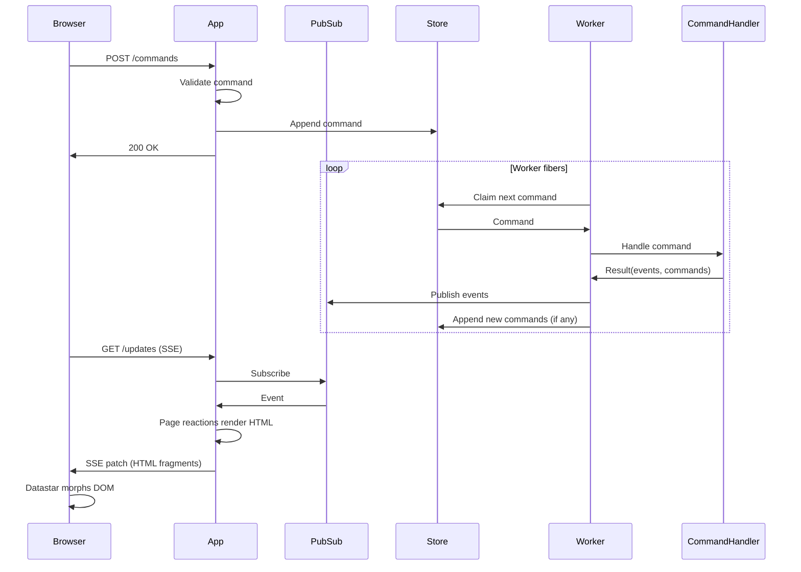

# Sidereal

A Ruby gem for building server-driven reactive web applications. Sidereal combines a Rack-compatible trie-based router with an event-driven architecture using typed messages, commands, pages, and pub/sub. The server pushes HTML updates to the browser via SSE -- no client-side JS framework needed.

Built on [Datastar](https://data-star.dev/) (SSE streaming), [Phlex](https://www.phlex.fun/) (HTML rendering), [Plumb](https://github.com/ismasan/plumb) (typed data), [Async](https://github.com/socketry/async) (fiber concurrency). Designed to run on [Falcon](https://github.com/socketry/falcon).

## Installation

Add to your Gemfile:

```bash
bundle add sidereal
```

Or install directly:

```bash
gem install sidereal
```

## Quick start

A Sidereal app has three main parts: **messages** (typed data), **command handlers** (state changes), and **pages** (reactive UI).

```ruby
require 'sidereal'

# 1. Define messages
AddTodo = Sidereal::Message.define('todos.add') do
  attribute :title, Sidereal::Types::String.present
end

# 2. Define a page
class TodoPage < Sidereal::Page
  path '/'

  # React to events by pushing HTML updates via SSE
  on AddTodo do |evt|
    browser.patch_elements load(params)
  end

  def self.load(_params, _ctx)
    new(todos: TODOS.values)
  end

  def initialize(todos: [])
    @todos = todos
  end

  def view_template
    div do
      command AddTodo do |f|
        f.text_field :title, placeholder: 'What needs to be done?'
        button(type: :submit) { 'Add' }
      end

      ul do
        @todos.each { |t| li { t.title } }
      end
    end
  end
end

# 3. Wire it up in an App
TODOS = {}

class TodoApp < Sidereal::App
  session secret: ENV.fetch('SESSION_SECRET')

  command AddTodo do |cmd|
    TODOS[cmd.id] = cmd.payload
  end

  page TodoPage
end
```

## How it works



Commands are processed asynchronously by worker fibers. The browser never waits for command handling to complete -- it submits the command and receives UI updates via the SSE stream as events are produced.

## Messages

Messages are typed, immutable data objects defined with `Message.define`. Each message has an auto-generated UUID, a type string, timestamps, metadata, and a typed payload.

```ruby
AddTodo = Sidereal::Message.define('todos.add') do
  attribute :todo_id, Sidereal::Types::AutoUUID
  attribute :title, Sidereal::Types::String.present
end

RemoveTodo = Sidereal::Message.define('todos.remove') do
  attribute :todo_id, Sidereal::Types::UUID::V4
end

Notify = Sidereal::Message.define('todos.notify') do
  attribute :message, String
end
```

Messages use dot-separated type strings (e.g. `'todos.add'`) for registry lookup and serialization. Payload attributes are validated using [Plumb](https://github.com/ismasan/plumb) types.

```ruby
cmd = AddTodo.new(payload: { title: 'Buy milk' })
cmd.id              # => "a1b2c3d4-..."
cmd.type            # => "todos.add"
cmd.payload.title   # => "Buy milk"
cmd.created_at      # => 2026-03-26 10:00:00 +0000
```

### Correlation chain

Messages maintain a causation/correlation chain for traceability:

```ruby
event = source_cmd.correlate(SomeEvent.new(payload: { ... }))
event.causation_id    # => source_cmd.id
event.correlation_id  # => source_cmd.correlation_id
```

## Router

`Sidereal::Router` is a standalone Rack-compatible router with a Sinatra-style DSL and trie-based dispatch. It can be used independently of the full Sidereal app framework.

### Basic routes

Route blocks are evaluated in the context of a router instance, with access to `request`, `response`, and helper methods like `body`, `status`, `headers`, `halt`, and `redirect`.

```ruby
class MyRouter < Sidereal::Router
  get '/' do
    body 'hello'
  end

  get '/items/:id' do |id:|
    body "item #{id}"
  end

  post '/items' do
    status 201
    body 'created'
  end

  redirect '/old-path', '/new-path'
end

# config.ru
run MyRouter
```

### Callable handlers

Any object responding to `#call(request, response, params)` can be used as a handler. Callable handlers can either modify the `response` object or return a raw Rack triplet (`[status, headers, body]`).

```ruby
class ShowItem
  def call(request, response, params)
    response.body = ["item #{params[:id]}"]
  end
end

class MyRouter < Sidereal::Router
  get '/items/:id', ShowItem.new

  # Lambdas work too
  get '/health', ->(req, resp, params) { [200, {}, ['ok']] }
end
```

### Before hook

Run logic before every matched route. Use `halt` to short-circuit.

```ruby
class MyRouter < Sidereal::Router
  before do
    halt 401, 'unauthorized' unless session[:user_id]
  end

  get '/dashboard' do
    body 'welcome'
  end
end
```

### Rendering components

The `component` helper renders any object responding to `#call(context:)`, passing the router instance as context. This is how Sidereal pages and layouts are rendered under the hood.

```ruby
class MyRouter < Sidereal::Router
  get '/dashboard' do
    component DashboardPage.new(current_user)
  end

  get '/error' do
    component ErrorPage.new, status: 422
  end
end
```

### Sessions

```ruby
class MyRouter < Sidereal::Router
  session secret: ENV.fetch('SESSION_SECRET')

  post '/login' do
    session[:user_id] = request.params['user_id']
    body 'logged in'
  end

  get '/profile' do
    body "user: #{session[:user_id]}"
  end
end
```

### Halt and redirect

`halt` immediately stops request processing and returns a response.

```ruby
halt 422                              # status only
halt 200, 'hello'                     # status + body
halt 301, 'Location' => '/new-path'   # status + headers
halt 200, { 'X-Custom' => '1' }, 'ok' # status + headers + body
```

`redirect` is a shorthand for halting with a Location header:

```ruby
redirect '/new-path'              # 301 by default
redirect '/new-path', status: 302 # temporary redirect
```

## App

`Sidereal::App` extends `Router` with the full reactive framework: commands, pages, layouts, and SSE streaming. It automatically sets up `POST /commands` and `GET /updates` endpoints.

```ruby
class ChatApp < Sidereal::App
  session secret: ENV.fetch('SESSION_SECRET')
  layout ChatLayout

  command SendMessage do |cmd|
    MessageLog.append(cmd)
    dispatch Notify, message: "#{cmd.payload.author}: #{cmd.payload.content}"
  end

  command Notify do |cmd|
    # no-op, but events from this command will still be published
  end

  page ChatPage
end
```

### Commands

Register command handlers with `command`. Inside a handler, use `dispatch` to produce events or enqueue follow-up commands.

```ruby
command AddTodo do |cmd|
  TODOS[cmd.payload.todo_id] = cmd.payload

  # Dispatching a registered command type enqueues it for processing
  dispatch SendEmail, to: 'user@example.com'

  # Dispatching any other message type produces a transient event
  dispatch Notify, message: "Added: #{cmd.payload.title}"
end
```

### Broadcast

Use `broadcast` inside a command handler to publish a message immediately to the SSE stream, without waiting for the command to finish processing. Useful for progress indicators.

```ruby
command AskLLM do |cmd|
  broadcast Working  # immediately tells the UI "thinking..."

  response = llm.ask(cmd.payload.content)
  dispatch SendMessage, author: 'Bot', content: response.content
end
```

### Command helpers

Define helper methods available inside command handlers:

```ruby
class ChatApp < Sidereal::App
  command_helpers do
    private def chat
      @chat ||= RubyLLM.chat
    end
  end

  command AskLLM do |cmd|
    response = chat.ask(cmd.payload.content)
    dispatch SendMessage, author: 'Bot', content: response.content
  end
end
```

## Pages

Pages are reactive [Phlex](https://www.phlex.fun/) components that re-render parts of the UI in response to events via SSE.

```ruby
class TodoPage < Sidereal::Page
  path '/'

  # React to events -- re-render components via SSE
  on AddTodo do |evt|
    browser.patch_elements TodoList.new(TODOS.values)
  end

  on RemoveTodo do |evt|
    browser.patch_elements TodoList.new(TODOS.values)
  end

  on Notify do |evt|
    browser.patch_elements ActivityItem.new(evt), mode: 'append', selector: '#feed'
  end

  # Load is called on initial page render and on SSE reconnect
  def self.load(_params, _ctx)
    new(todos: TODOS.values)
  end

  def initialize(todos: [])
    @todos = todos
  end

  def view_template
    div do
      render TodoList.new(@todos)

      aside do
        h2 { 'Activity' }
        div(id: 'feed')
      end
    end
  end
end
```

### SSE reactions

Inside an `on` block, you have access to:

- `browser` -- the SSE stream for pushing updates
- `load(params)` -- re-instantiate the page with current data
- `params` -- the current page params from Datastar signals

```ruby
on AddTodo do |evt|
  # Replace an element's content with a re-rendered component
  browser.patch_elements load(params)

  # Or target a specific element
  browser.patch_elements TodoList.new(TODOS.values)

  # Append to a container
  browser.patch_elements ActivityItem.new(evt), mode: 'append', selector: '#feed'

  # Patch signal values
  browser.patch_signals progress: 99

  # Execute JavaScript on the client
  browser.execute_script %(scrollToBottom('messages'))
end
```

See more about this [here](https://github.com/starfederation/datastar-ruby#datastar-methods).

### Sub-components

Define inline components as separated classes (or nested classes) for partial re-renders:

```ruby
class TodoPage < Sidereal::Page
  class TodoList < Sidereal::Components::BaseComponent
    def initialize(todos)
      @todos = todos
    end

    def view_template
      div(id: 'todos') do
        @todos.each do |todo|
          li { todo.title }
        end
      end
    end
  end
end
```

### Command forms

The `command` helper renders a form wired to `POST /commands` via Datastar. It handles hidden fields, AJAX submission, and server-side validation error display automatically.

```ruby
def view_template
  command AddTodo, class: 'add-form' do |f|
    f.text_field :title, placeholder: 'What needs to be done?'
    button(type: :submit) { 'Add' }
  end

  # Hidden payload fields (not shown to the user)
  command RemoveTodo do |f|
    f.payload_fields(todo_id: todo.todo_id)
    button(type: :submit) { 'Remove' }
  end
end
```

## Layout

Define a layout by subclassing `Sidereal::Components::Layout`. Use the `sidereal_head`, `sidereal_foot`, and `sidereal_signals` helpers to wire up Datastar.

```ruby
class AppLayout < Sidereal::Components::Layout
  def view_template
    doctype

    html do
      head do
        meta(name: 'viewport', content: 'width=device-width, initial-scale=1.0')
        title { 'My App' }
        sidereal_head  # loads Datastar JS
      end
      body(data: sidereal_signals) do
        div(class: 'page') do
          render page   # renders the current page component
        end

        sidereal_foot   # initializes SSE connection (must be at the bottom)
      end
    end
  end
end
```

Set the layout in your App:

```ruby
class MyApp < Sidereal::App
  layout AppLayout
  # ...
end
```

A `BasicLayout` with reset CSS and form styling is provided by default if no layout is specified.

## Running with Falcon

Sidereal is designed to run on [Falcon](https://github.com/socketry/falcon), which provides the async fiber runtime needed for SSE streaming and concurrent command processing.

Create a `falcon.rb` file:

```ruby
#!/usr/bin/env falcon-host
# frozen_string_literal: true

require_relative 'app'
require 'sidereal/falcon/environment'

service "my-app" do
  include Sidereal::Falcon::Environment
  include Falcon::Environment::Rackup

  url "http://localhost:9292"
  count 1
end
```

Run with:

```bash
bundle exec falcon host
```

### Configuration

```ruby
Sidereal.configure do |c|
  c.workers = 3  # number of worker fibers processing commands
end
```

## Development

After checking out the repo, run `bin/setup` to install dependencies. Then, run `bundle exec rspec` to run the tests. You can also run `bin/console` for an interactive prompt.

## Contributing

Bug reports and pull requests are welcome on GitHub at https://github.com/ismasan/sidereal.

## License

The gem is available as open source under the terms of the [MIT License](https://opensource.org/licenses/MIT).
