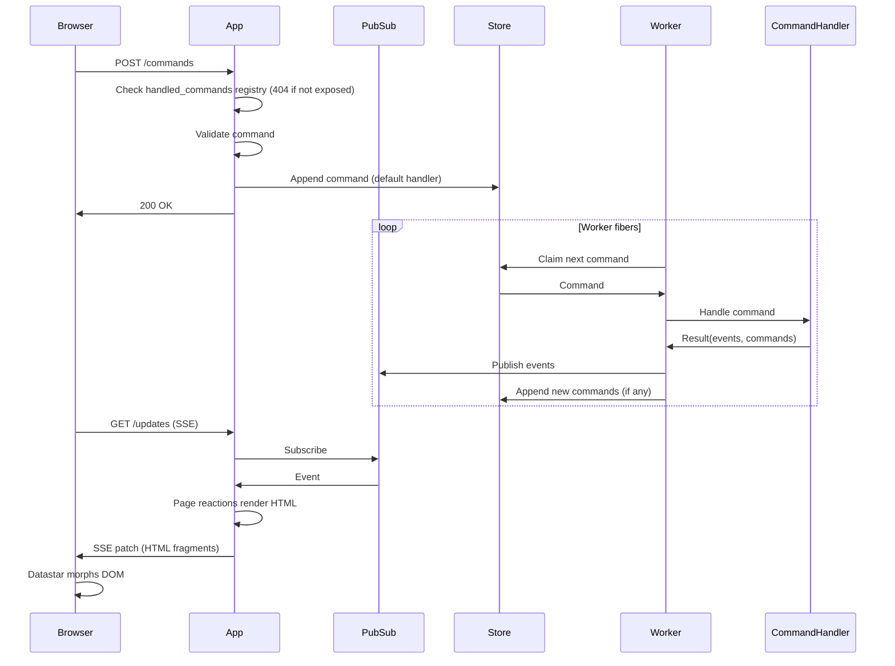

# Sidereal

A Ruby gem for building server-driven reactive web applications. Sidereal combines a Rack-compatible trie-based router with an event-driven architecture using typed messages, commands, pages, and pub/sub. The server pushes HTML updates to the browser via SSE -- no client-side JS framework needed.

Built on [Datastar](https://data-star.dev/) (SSE streaming), [Phlex](https://www.phlex.fun/) (HTML rendering), [Plumb](https://github.com/ismasan/plumb) (typed data), [Async](https://github.com/socketry/async) (fiber concurrency). Designed to run on [Falcon](https://github.com/socketry/falcon).

## Installation

Add to your Gemfile:

```bash
bundle add sidereal
```

Or install directly:

```bash
gem install sidereal
```

## Quick start

A Sidereal app has three main parts: **messages** (typed data), **command handlers** (state changes), and **pages** (reactive UI).

```ruby
require 'sidereal'

# 1. Define messages
AddTodo = Sidereal::Message.define('todos.add') do
  attribute :title, Sidereal::Types::String.present
end

# 2. Define a page
class TodoPage < Sidereal::Page
  path '/'

  # React to events by pushing HTML updates via SSE
  on AddTodo do |evt|
    browser.patch_elements load(params)
  end

  def self.load(_params, _ctx)
    new(todos: TODOS.values)
  end

  def initialize(todos: [])
    @todos = todos
  end

  def view_template
    div do
      # An Ajax form to dispatch a command to the backend 
      command AddTodo do |f|
        f.text_field :title, placeholder: 'What needs to be done?'
        button(type: :submit) { 'Add' }
      end

      ul do
        @todos.each { |t| li { t.title } }
      end
    end
  end
end

# 3. Wire it up in an App
TODOS = {}

class TodoApp < Sidereal::App
  session secret: ENV.fetch('SESSION_SECRET')

  # Expose AddTodo to the browser's POST /commands
  handle AddTodo

  # Register the async worker handler
  command AddTodo do |cmd|
    TODOS[cmd.id] = cmd.payload
  end

  page TodoPage
end
```

## Messages

Messages are typed, immutable data objects defined with `Message.define`. Each message has an auto-generated UUID, a type string, timestamps, metadata, and a typed payload.

```ruby
AddTodo = Sidereal::Message.define('todos.add') do
  attribute :todo_id, Sidereal::Types::AutoUUID
  attribute :title, Sidereal::Types::String.present
end

RemoveTodo = Sidereal::Message.define('todos.remove') do
  attribute :todo_id, Sidereal::Types::UUID::V4
end

Notify = Sidereal::Message.define('todos.notify') do
  attribute :message, String
end
```

Messages use dot-separated type strings (e.g. `'todos.add'`) for registry lookup and serialization. Payload attributes are validated using [Plumb](https://github.com/ismasan/plumb) types.

```ruby
cmd = AddTodo.new(payload: { title: 'Buy milk' })
cmd.id              # => "a1b2c3d4-..."
cmd.type            # => "todos.add"
cmd.payload.title   # => "Buy milk"
cmd.created_at      # => 2026-03-26 10:00:00 +0000
```

### Correlation chain

Messages maintain a causation/correlation chain for traceability:

```ruby
event = source_cmd.correlate(SomeEvent.new(payload: { ... }))
event.causation_id    # => source_cmd.id
event.correlation_id  # => source_cmd.correlation_id
```

## App

`Sidereal::App` is a web router with that implements a full reactive framework: commands, pages, layouts, and SSE streaming. It automatically sets up `POST /commands` and `GET /updates` endpoints.

```ruby
class ChatApp < Sidereal::App
  session secret: ENV.fetch('SESSION_SECRET')
  layout ChatLayout

  # SendMessage is submitted from the browser
  handle SendMessage

  command SendMessage do |cmd|
    MessageLog.append(cmd)
    dispatch Notify, message: "#{cmd.payload.author}: #{cmd.payload.content}"
  end

  # Notify is dispatched internally and never exposed to the web
  command Notify do |cmd|
    # no-op, but events from this command will still be published
  end

  page ChatPage
end
```

### Commands

Commands are split into two registrations:

- `command` registers an async handler with the app's `Commander`. Worker fibers pick the command off the store and run this block. Commands registered *only* via `command` are **internal** — they can be produced by other handlers, automations, or sagas, but cannot be submitted from the browser.
- `handle` exposes a command to `POST /commands` (see [Custom command handlers](#custom-command-handlers)). Any type that isn't `handle`-registered returns `404` on POST.

Inside a `command` block, use `dispatch` to produce events or enqueue follow-up commands.

```ruby
# Internal command — dispatched from other handlers, never from the browser
SendEmail = Sidereal::Message.define('mail.send') { attribute :to, String }

command SendEmail do |cmd|
  Mailer.deliver(cmd.payload.to)
end

# Web-facing command — exposed via `handle`, processed async via `command`
handle AddTodo

command AddTodo do |cmd|
  TODOS[cmd.payload.todo_id] = cmd.payload

  # Dispatching a registered command type enqueues it for processing
  dispatch SendEmail, to: 'user@example.com'

  # Dispatching any other message type produces a transient event
  dispatch Notify, message: "Added: #{cmd.payload.title}"
end
```

### Broadcast

Use `broadcast` inside a command handler to publish a message immediately to the SSE stream, without waiting for the command to finish processing. Useful for progress indicators.

```ruby
command AskLLM do |cmd|
  broadcast Working  # immediately tells the UI "thinking..."

  response = llm.ask(cmd.payload.content)
  dispatch SendMessage, author: 'Bot', content: response.content
end
```

### Command helpers

Define helper methods available inside command handlers:

```ruby
class ChatApp < Sidereal::App
  command_helpers do
    private def chat
      @chat ||= RubyLLM.chat
    end
  end

  command AskLLM do |cmd|
    response = chat.ask(cmd.payload.content)
    dispatch SendMessage, author: 'Bot', content: response.content
  end
end
```

### Custom command handlers

`handle` declares which commands the browser is allowed to submit to `POST /commands`. Types not registered with `handle` return `404`.

`handle` accepts one or more command classes. Called without a block, it installs the default handler: validate the command, append it to the async store, and return `200`. Worker fibers then pick it up and run the matching `command` block.

```ruby
class TodoApp < Sidereal::App
  # Expose multiple commands at once with the default handler
  handle AddTodo, RemoveTodo

  command AddTodo do |cmd|  # async worker handler
    TODOS[cmd.payload.todo_id] = cmd.payload
  end
end
```

Pass a block to `handle` to process the command **synchronously** during the HTTP request instead — useful for lightweight mutations, or when you want to stream DOM updates back to the browser immediately:

```ruby
handle AddTodo do |cmd|
  TODOS[cmd.id] = cmd.payload.to_h
  browser.patch_elements TodoList.new(TODOS.values)
end
```

A custom `handle` block replaces the default async-dispatch behaviour. If you still want the async worker to run, call `dispatch(cmd)` inside the block.

```ruby
handle AddTodo do |cmd|
  browser.patch_elements %(<p id="notification">Processing...</p>)
  dispatch(cmd) # <= schedule command for background processing
end
```


`handle` does **not** register the command with the async `Commander`. To have a web-submitted command also processed by workers, pair `handle` with a `command` block as shown above.

Inside a `handle` block you have access to:

- `browser` — the SSE stream for pushing DOM updates (see [SSE reactions](#sse-reactions) for the full API)
- `dispatch(MessageClass, payload)` — correlate and append a follow-up command to the async store
- `patch_command_errors(errors)` — stream field-level validation errors back to the form
- `store`, `pubsub`, `params`, `session` — the usual App instance helpers

#### Streaming DOM updates

When the browser submits a command via Datastar (the default), the request accepts SSE responses. The `handle` block can use `browser` to push HTML patches, signal updates, or JavaScript execution — just like page `on` reactions:

```ruby
handle AddTodo do |cmd|
  TODOS[cmd.id] = cmd.payload.to_h

  browser.patch_elements TodoList.new(TODOS.values)
  browser.patch_signals todo_count: TODOS.size
  browser.execute_script %(document.querySelector('.flash').textContent = 'Saved!')
end
```

`browser` is an alias for the Datastar dispatcher — each call above produces a one-off SSE event. For multi-step, real-time updates over a single request, use `browser.stream { |sse| ... }`:

```ruby
handle GenerateReport do |cmd|
  browser.stream do |sse|
    sse.patch_elements %(<div id="status">Working...</div>)
    expensive_work do |progress|
      sse.patch_signals progress: progress
    end
    sse.patch_elements %(<div id="status">Done</div>)
  end
end
```

The `handle` block runs synchronously before any SSE streaming starts, so `session[:x] = …` writes inside it commit to the session cookie as expected.

#### Dispatching follow-up commands

Use `dispatch` to enqueue a command for async processing. The dispatched command is automatically correlated to the source command:

```ruby
handle AddTodo do |cmd|
  TODOS[cmd.id] = cmd.payload.to_h
  dispatch NotifyUser, text: "Todo added: #{cmd.payload.title}"
  browser.patch_elements TodoList.new(TODOS.values)
end
```

#### Custom validation with error streaming

Use `patch_command_errors` to stream field-level errors back to the form. This works with the `command` form component, which generates the matching element IDs:

```ruby
handle PlaceOrder do |cmd|
  errors = validate_stock(cmd.payload)
  if errors.any?
    patch_command_errors(errors)
  else
    ORDERS[cmd.id] = cmd.payload.to_h
    browser.patch_elements OrderConfirmation.new(cmd.payload)
  end
end
```

## Pages

Pages are reactive [Phlex](https://www.phlex.fun/) components that re-render parts of the UI in response to events via SSE.

```ruby
class TodoPage < Sidereal::Page
  path '/'

  # React to events -- re-render components via SSE
  on AddTodo do |evt|
    browser.patch_elements TodoList.new(TODOS.values)
  end

  on RemoveTodo do |evt|
    browser.patch_elements TodoList.new(TODOS.values)
  end

  on Notify do |evt|
    browser.patch_elements ActivityItem.new(evt), mode: 'append', selector: '#feed'
  end

  # Load is called on initial page render and on SSE reconnect
  def self.load(_params, _ctx)
    new(todos: TODOS.values)
  end

  def initialize(todos: [])
    @todos = todos
  end

  def view_template
    div do
      render TodoList.new(@todos)

      aside do
        h2 { 'Activity' }
        div(id: 'feed')
      end
    end
  end
end
```

### SSE reactions

Inside an `on` block, you have access to:

- `browser` -- the SSE stream for pushing updates
- `load(params)` -- re-instantiate the page with current data
- `params` -- the current page params from Datastar signals

```ruby
on AddTodo do |evt|
  # Replace an element's content with a re-rendered component
  browser.patch_elements load(params)

  # Or target a specific element
  browser.patch_elements TodoList.new(TODOS.values)

  # Append to a container
  browser.patch_elements ActivityItem.new(evt), mode: 'append', selector: '#feed'

  # Patch signal values
  browser.patch_signals progress: 99

  # Execute JavaScript on the client
  browser.execute_script %(scrollToBottom('messages'))
end
```

See more about this [here](https://github.com/starfederation/datastar-ruby#datastar-methods).

### Per-page channels

Each page subscribes to a single PubSub channel via `GET /updates/:channel_name`. The default is `'system'`, which means every page receives every published event. Override `Page#channel_name` to scope a page's SSE stream to a narrower topic — for example, "only events for this donation" or "only events for this chat room".

```ruby
class DonationPage < Sidereal::Page
  path '/:donation_id'

  def initialize(donation_id:, **)
    @donation_id = donation_id
  end

  # Each donation page only receives events on its own channel
  def channel_name = "donations.#{@donation_id}"
end
```

For events to actually reach that channel, the publisher needs to stamp them with matching channel metadata. The Falcon worker publishes each event to `event.metadata[:channel]` (falling back to `'system'`), so set it via `with_metadata` — typically inside a `handle` block when the command first enters the system:

```ruby
class DonationsApp < Sidereal::App
  handle SelectAmount do |cmd|
    dispatch cmd.with_metadata(channel: "donations.#{cmd.payload.donation_id}")
  end
end
```

The channel propagates through the correlation chain, so downstream commands and events dispatched in response stay on the same channel without further wiring.

### Sub-components

Define inline components as separated classes (or nested classes) for partial re-renders:

```ruby
class TodoPage < Sidereal::Page
  class TodoList < Sidereal::Components::BaseComponent
    def initialize(todos)
      @todos = todos
    end

    def view_template
      div(id: 'todos') do
        @todos.each do |todo|
          li { todo.title }
        end
      end
    end
  end
end
```

### Command forms

The `command` helper renders a form wired to `POST /commands` via Datastar. It handles hidden fields, AJAX submission, and server-side validation error display automatically.

```ruby
def view_template
  command AddTodo, class: 'add-form' do |f|
    f.text_field :title, placeholder: 'What needs to be done?'
    button(type: :submit) { 'Add' }
  end

  # Hidden payload fields (not shown to the user)
  command RemoveTodo do |f|
    f.payload_fields(todo_id: todo.todo_id)
    button(type: :submit) { 'Remove' }
  end
end
```

## Layout

Define a layout by subclassing `Sidereal::Components::Layout`. The base class overrides `head` and `body` to automatically inject the necessary Datastar wiring:

- **`head`** — appends the Datastar JS script tag after your content.
- **`body`** — adds page signals (`page_key`, `params`) to the `data` attribute and appends the SSE init div at the end.

```ruby
class AppLayout < Sidereal::Components::Layout
  def view_template
    doctype

    html do
      head do
        meta(name: 'viewport', content: 'width=device-width, initial-scale=1.0')
        title { 'My App' }
      end
      body do
        div(class: 'page') do
          render page   # renders the current page component
        end
      end
    end
  end
end
```

You can pass additional data attributes and signals to `body`. Extra signals are merged with the default page signals:

```ruby
body(data: { class: 'app', signals: { theme: 'dark' } }) do
  render page
end
```

Set the layout in your App:

```ruby
class MyApp < Sidereal::App
  layout AppLayout
  # ...
end
```

A `BasicLayout` with reset CSS and form styling is provided by default if no layout is specified.

## Router

`Sidereal::App` is a subclass of`Sidereal::Router` , which is a standalone Rack-compatible router with a Sinatra-style DSL and trie-based dispatch. It can be used independently of the full Sidereal app framework.

### Basic routes

Route blocks are evaluated in the context of a router instance, with access to `request`, `response`, and helper methods like `body`, `status`, `headers`, `halt`, and `redirect`.

```ruby
class MyRouter < Sidereal::Router
  get '/' do
    body 'hello'
  end

  get '/items/:id' do |id:|
    body "item #{id}"
  end

  post '/items' do
    status 201
    body 'created'
  end

  redirect '/old-path', '/new-path'
end

# config.ru
run MyRouter
```

### Callable handlers

Any object responding to `#call(request, response, params)` can be used as a handler. Callable handlers can either modify the `response` object or return a raw Rack triplet (`[status, headers, body]`).

```ruby
class ShowItem
  def call(request, response, params)
    response.body = ["item #{params[:id]}"]
  end
end

class MyRouter < Sidereal::Router
  get '/items/:id', ShowItem.new

  # Lambdas work too
  get '/health', ->(req, resp, params) { [200, {}, ['ok']] }
end
```

### Before hook

Run logic before every matched route. Use `halt` to short-circuit.

```ruby
class MyRouter < Sidereal::Router
  before do
    halt 401, 'unauthorized' unless session[:user_id]
  end

  get '/dashboard' do
    body 'welcome'
  end
end
```

### Rendering components

The `component` helper renders any object responding to `#call(context:)`, passing the router instance as context. This is how Sidereal pages and layouts are rendered under the hood.

```ruby
class MyRouter < Sidereal::Router
  get '/dashboard' do
    component DashboardPage.new(current_user)
  end

  get '/error' do
    component ErrorPage.new, status: 422
  end
end
```

### Sessions

```ruby
class MyRouter < Sidereal::Router
  session secret: ENV.fetch('SESSION_SECRET')

  post '/login' do
    session[:user_id] = request.params['user_id']
    body 'logged in'
  end

  get '/profile' do
    body "user: #{session[:user_id]}"
  end
end
```

### Halt and redirect

`halt` immediately stops request processing and returns a response.

```ruby
halt 422                              # status only
halt 200, 'hello'                     # status + body
halt 301, 'Location' => '/new-path'   # status + headers
halt 200, { 'X-Custom' => '1' }, 'ok' # status + headers + body
```

`redirect` is a shorthand for halting with a Location header:

```ruby
redirect '/new-path'              # 301 by default
redirect '/new-path', status: 302 # temporary redirect
```

## Running with Falcon

Sidereal is designed to run on [Falcon](https://github.com/socketry/falcon), which provides the async fiber runtime needed for SSE streaming and concurrent command processing.

Create a `falcon.rb` file:

```ruby
#!/usr/bin/env falcon-host
# frozen_string_literal: true

require_relative 'app'
require 'sidereal/falcon/environment'

service "my-app" do
  include Sidereal::Falcon::Environment
  include Falcon::Environment::Rackup

  url "http://localhost:9292"
  count 1
end
```

Run with:

```bash
bundle exec falcon host
```

### Configuration

```ruby
Sidereal.configure do |c|
  c.workers = 3  # number of worker fibers processing commands
end
```

### Custom backends

The store, pubsub, and dispatcher are configurable. By default Sidereal uses in-memory implementations, but you can swap them out:

```ruby
Sidereal.configure do |c|
  c.store = MyCustomStore.new       # default: Sidereal::Store::Memory
  c.pubsub = MyCustomPubSub.new     # default: Sidereal::PubSub::Memory
  c.dispatcher = MyDispatcherClass   # default: Sidereal::Dispatcher (a class, not an instance)
end
```

A custom store must respond to `#append(message)`. A custom dispatcher must respond to `.spawn_into(task)` (class-level) and `#stop`.

## How it works



Commands are processed asynchronously by worker fibers. The browser never waits for command handling to complete -- it submits the command and receives UI updates via the SSE stream as events are produced.

## Using Sourced::CCC as a backend

[Sourced CCC](https://github.com/ismasan/sourced) is an event sourcing library with a persistent SQLite store, partition-aware consumer groups, and a signal-driven dispatcher. Sidereal can use it as a drop-in backend, replacing the in-memory store and dispatcher.

### Setup

```ruby
require 'sidereal'
require 'sourced/ccc'

# Configure CCC with a SQLite database
Sourced::CCC.configure do |c|
  c.store = Sequel.sqlite('db/app.db')
end

# Point Sidereal at CCC's store and dispatcher
Sidereal.configure do |c|
  c.store = Sourced::CCC.store
  c.dispatcher = Sourced::CCC::Dispatcher
end
```

### Defining messages and Deciders

With CCC as the backend, use CCC messages and Deciders instead of `App.command`:

```ruby
# Define messages using CCC's message class
AddTodo = Sourced::CCC::Message.define('todos.add') do
  attribute :title, String
end

TodoAdded = Sourced::CCC::Message.define('todos.added') do
  attribute :title, String
  attribute :todo_id, String
end

# Define a Decider (replaces App.command for async processing)
class TodoDecider < Sourced::CCC::Decider
  partition_by :todo_id

  command AddTodo do |state, cmd|
    event TodoAdded, title: cmd.payload.title, todo_id: SecureRandom.uuid
  end

  # Publish events to Sidereal's PubSub for SSE streaming
  after_sync do |state:, events:|
    events.each do |evt|
      channel = evt.metadata[:channel] || 'system'
      Sidereal.pubsub.publish(channel, evt)
    end
  end
end

Sourced::CCC.register(TodoDecider)
```

The `after_sync` block runs after the store transaction commits and pushes events into Sidereal's PubSub, where Page reactions pick them up and stream DOM updates via SSE.

### Pages and App

Pages and the App work the same way. `handle` exposes commands to the browser, and Page `on` reactions respond to events from the Decider's `after_sync`:

```ruby
class TodoPage < Sidereal::Page
  path '/'

  on TodoAdded do |evt|
    browser.patch_elements load(params)
  end

  def self.load(_params, _ctx)
    new(todos: TODOS.values)
  end

  # ...
end

class TodoApp < Sidereal::App
  session secret: ENV.fetch('SESSION_SECRET')

  # Expose AddTodo to the browser — the default handler
  # appends it to the CCC store for async processing
  handle AddTodo

  page TodoPage
end
```

### Synchronous CCC handling

You can also process a command synchronously during the HTTP request using `Sourced::CCC.handle!`, which loads history, runs the Decider, appends events, and returns immediately:

```ruby
handle AddTodo do |cmd|
  _cmd, _decider, events = Sourced::CCC.handle!(TodoDecider, cmd)
  events.each { |evt| pubsub.publish(channel_name, evt) }
  browser.patch_elements TodoList.new(TODOS.values)
end
```

### Falcon service

The standard Sidereal Falcon environment works with CCC -- it uses the configured dispatcher automatically:

```ruby
#!/usr/bin/env falcon-host
require_relative 'app'
require 'sidereal/falcon/environment'

service "my-app" do
  include Sidereal::Falcon::Environment
  include Falcon::Environment::Rackup

  url "http://localhost:9292"
  count 1
end
```

## Development

After checking out the repo, run `bin/setup` to install dependencies. Then, run `bundle exec rspec` to run the tests. You can also run `bin/console` for an interactive prompt.

## Contributing

Bug reports and pull requests are welcome on GitHub at https://github.com/ismasan/sidereal.

## License

The gem is available as open source under the terms of the [MIT License](https://opensource.org/licenses/MIT).
