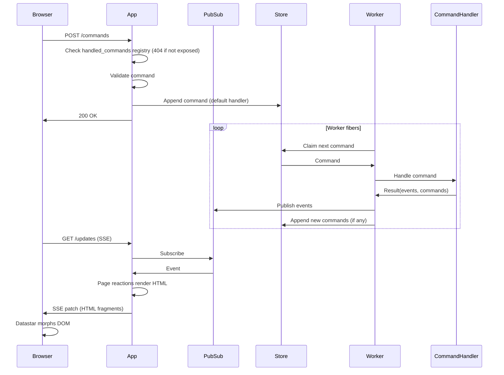

# Sidereal

[](https://www.rubyforum.org/tag/sidereal)

A Ruby gem for building server-driven, reactive web applications. Sidereal combines a Rack-compatible router with an event-driven architecture using typed messages, commands, pages, SSE, and pub/sub.

* All commands are handled by an asynchronous runtime. No distinction between "controllers" and "background jobs".
* Async command handlers automatically notify completion to pub/sub interface.
* Long-lived SSE connection can subscribe to pub/sub and push server-rendered templates back to browser.
* Swappable backends for (optional) Event Sourcing support.

Only one way to reason about business logic handling and UI updates, whether one-off or long-running, re-tryable tasks.

I talked about the motivation and techniques [here](https://www.youtube.com/watch?v=Q6owchf4WEo).

<video src="https://github.com/user-attachments/assets/ebc2dd68-52e7-4386-b129-692f5e8f2423" controls muted style="width: 100%; max-width: 100%;"></video>

Built on [Datastar](https://data-star.dev/) (SSE streaming, HTML morphing), [Phlex](https://www.phlex.fun/) (HTML rendering), [Plumb](https://github.com/ismasan/plumb) (typed data), [Async](https://github.com/socketry/async) (fiber concurrency). Designed to run on [Falcon](https://github.com/socketry/falcon).

See the [examples](https://github.com/ismasan/sidereal/tree/main/examples) directory for demos.

## Installation

Add to your Gemfile:

```bash
bundle add sidereal
```

Or install directly:

```bash
gem install sidereal
```

## Setup

Installing the gem gives you the `sid` command. Use it to generate a new app:

```bash
sid new my_app
cd my_app
bin/dev
```

`sid new` creates the `my_app` directory, runs `bundle install` and `bin/sid skills update` in it, and prints how to start the server. `bin/dev` starts it at <http://localhost:9292>. Open the page in two windows and say hello: every window sees every hello as it happens.

`sid new` options:

| Option | What it does |
| --- | --- |
| `--rspec` | Adds RSpec to the Gemfile and runs `rspec --init` |
| `--db` | Sets up a SQLite database, by running [`bin/sid db install`](#database) in the new app |
| `--sourced` | Uses [Sourced](https://github.com/ismasan/sourced) for durable, event-sourced storage, by running [`bin/sid sourced install`](#sourced), which installs a database too |
| `--sidereal-path PATH` | Uses a local checkout of Sidereal in the Gemfile, instead of GitHub |
| `--skip-bundle` | Doesn't run `bundle install`, or `bin/sid skills update`, which needs the bundle |
| `--no-skills` | Doesn't install AI agent skills with `bin/sid skills update` (see [Agent skills](#agent-skills)) |
| `--force` | Writes into a directory that isn't empty |

The app's name comes before the options: `sid new my_app --rspec`.

### What's in a new app

```
my_app/
  boot.rb                     loads and configures the app
  config.ru                   runs App
  config/components/          the connections and services the app's classes use
                              (db.rb and sourced.rb once their installs have run)
  db/migrations/              database migrations, with --db or --sourced
  falcon.rb                   Falcon settings: HOST, PORT and COUNT (worker processes)
  bin/dev                     development server that reloads on code changes
  bin/sid                     the sid command line, with this app loaded
  skills/                     skills that teach AI coding agents to use bin/sid
  .claude/skills, .agents/skills   links to skills/, where agents look for them
  system/                     backend code that doesn't know about the web
    greetings.rb              messages for the hello demo
  web/
    app.rb                    App: the commands it accepts, their handlers, and pages
    ui/                       pages, components and the layout (the UI namespace)
      welcome_page.rb         UI::WelcomePage
      layout.rb               UI::Layout
      components/hello.rb     UI::Components::Hello
    public/                   static files; config.ru serves web/public/css at /css
  storage/                    runtime data: the command store, pubsub socket, databases
```

Classes are loaded by [Zeitwerk](https://github.com/fxn/zeitwerk), so there are no `require` statements: name a file after the class it defines. Classes in `system/` are top-level (`system/greetings.rb` defines `Greetings`), and each directory under `web/` is a namespace (`web/ui/welcome_page.rb` defines `UI::WelcomePage`).

### Running the app in development

`bin/dev` runs `bundle exec falcon host` and reloads the app whenever a Ruby file in `system/` or `web/` changes, or `boot.rb`, `config.ru` or `falcon.rb` does. Browsers reconnect by themselves.

```bash
bin/dev                  # http://localhost:9292
PORT=9300 bin/dev        # another port
COUNT=2 bin/dev          # two worker processes
```

Reloading needs a file watcher: [watchexec](https://github.com/watchexec/watchexec) (`brew install watchexec`) or [fswatch](https://github.com/emcrisostomo/fswatch). Without one, the server still runs, without reloading. In production, run `bundle exec falcon host` instead.

## Quick start

A Sidereal app has three main parts: **commands** (typed data), **command handlers** (state changes), and **pages** (reactive UI).

```ruby
require 'sidereal'

# 1. Define command messages
AddTodo = Sidereal::Message.define('todos.add') do
  attribute :title, Sidereal::Types::String.present
end

# 2. Define a page
class TodoPage < Sidereal::Page
  path '/'

  # React to events by pushing HTML updates via SSE
  on AddTodo do |evt|
    browser.patch_elements load(params)
  end

  def self.load(_params, _ctx)
    new(todos: TODOS.values)
  end

  def initialize(todos: [])
    @todos = todos
  end

  def view_template
    div do
      # An Ajax form to dispatch a command to the backend 
      command AddTodo do |f|
        f.text_field :title, placeholder: 'What needs to be done?'
        button(type: :submit) { 'Add' }
      end

      ul do
        @todos.each { |t| li { t.title } }
      end
    end
  end
end

# 3. Wire it up in an App
TODOS = {}

class TodoApp < Sidereal::App
  session secret: ENV.fetch('SESSION_SECRET')

  # Expose AddTodo to the browser's POST /commands
  handle AddTodo

  # Register the async worker handler
  command AddTodo do |cmd|
    TODOS[cmd.id] = cmd.payload
  end

  page TodoPage
end
```

## Commands

Commands are typed, immutable data objects defined with `Message.define`. Each message has an auto-generated UUID, a type string, timestamps, metadata, and a typed payload.

```ruby
AddTodo = Sidereal::Message.define('todos.add') do
  attribute :todo_id, Sidereal::Types::AutoUUID
  attribute :title, Sidereal::Types::String.present
end

RemoveTodo = Sidereal::Message.define('todos.remove') do
  attribute :todo_id, Sidereal::Types::UUID::V4
end

Notify = Sidereal::Message.define('todos.notify') do
  attribute :message, String
end
```

Commands use dot-separated type strings (e.g. `'todos.add'`) for registry lookup and serialization. Payload attributes are validated using [Plumb](https://github.com/ismasan/plumb) types.

```ruby
cmd = AddTodo.new(payload: { title: 'Buy milk' })
cmd.id              # => "a1b2c3d4-..."
cmd.type            # => "todos.add"
cmd.payload.title   # => "Buy milk"
cmd.created_at      # => 2026-03-26 10:00:00 +0000
```

### Correlation chain

Commands maintain a causation/correlation chain for traceability:

```ruby
event = source_cmd.correlate(SomeEvent.new(payload: { ... }))
event.causation_id    # => source_cmd.id
event.correlation_id  # => source_cmd.correlation_id
```

## App

`Sidereal::App` is a web router with that implements a full reactive framework: command handlers, pages, layouts, and SSE streaming. It automatically sets up `POST /commands` and `GET /updates/:channel_name` endpoints.

```ruby
class ChatApp < Sidereal::App
  session secret: ENV.fetch('SESSION_SECRET')
  layout ChatLayout

  # SendMessage is submitted from the browser
  # Use .handle to white-list this command in the HTTP endpoint
  handle SendMessage

  # Incoming command is dispatched to a background fiber,
  # and handled by this block
  # The block can optional #dispatch a new command in a workflow
  command SendMessage do |cmd|
    MessageLog.append(cmd)
    dispatch Notify, message: "#{cmd.payload.author}: #{cmd.payload.content}"
  end

  # Notify is dispatched internally and never exposed to the web
  command Notify do |cmd|
    # no-op, but events from this command will still be published
  end

  # Mount a page to be served on ChatPage.path
  page ChatPage
end
```

### Commands

Commands are split into two registrations:

- `command` registers an async handler with the app's `Commander`. Worker fibers pick the command off the store and run this block. Commands registered *only* via `command` are **internal** — they can be produced by other handlers, automations, or sagas, but cannot be submitted from the browser.
- `handle` exposes a command to `POST /commands` (see [Custom command handlers](#http-command-handlers)). Any type that isn't `handle`-registered returns `404` on POST.

Inside a `command` block, use `dispatch` to produce events or enqueue follow-up commands.

```ruby
# Internal command — dispatched from other handlers, never from the browser
SendEmail = Sidereal::Message.define('mail.send') { attribute :to, String }

command SendEmail do |cmd|
  Mailer.deliver(cmd.payload.to)
end

# Web-facing command — exposed via `handle`, processed async via `command`
handle AddTodo

command AddTodo do |cmd|
  TODOS[cmd.payload.todo_id] = cmd.payload

  # Dispatching a registered command type enqueues it for processing
  dispatch SendEmail, to: 'user@example.com'

  # Dispatching any other message type produces a transient event
  dispatch Notify, message: "Added: #{cmd.payload.title}"
end
```

### Broadcast

Use `broadcast` inside a command handler to publish a message immediately to the SSE stream, without waiting for the command to finish processing. Useful for progress indicators.

```ruby
command AskLLM do |cmd|
  broadcast Working  # immediately tells the UI "thinking..."

  response = llm.ask(cmd.payload.content)
  dispatch SendMessage, author: 'Bot', content: response.content
end
```

### Command helpers

Define helper methods available inside command handlers:

```ruby
class ChatApp < Sidereal::App
  command_helpers do
    private def chat
      @chat ||= RubyLLM.chat
    end
  end

  command AskLLM do |cmd|
    response = chat.ask(cmd.payload.content)
    dispatch SendMessage, author: 'Bot', content: response.content
  end
end
```

### HTTP command handlers

`handle` declares which commands the browser is allowed to submit to `POST /commands`. Types not registered with `handle` return `404`.

`handle` accepts one or more command classes. Called without a block, it installs the default handler: validate the command, append it to the async store, and return `200`. Worker fibers then pick it up and run the matching `command` block.

```ruby
class TodoApp < Sidereal::App
  # Expose multiple commands at once with the default handler
  handle AddTodo, RemoveTodo

  command AddTodo do |cmd|  # async worker handler
    TODOS[cmd.payload.todo_id] = cmd.payload
  end
end
```

Pass a block to `handle` to process the command **synchronously** during the HTTP request instead — useful for lightweight mutations, or when you want to stream DOM updates back to the browser immediately:

```ruby
handle AddTodo do |cmd|
  TODOS[cmd.id] = cmd.payload.to_h
  browser.patch_elements TodoList.new(TODOS.values)
end
```

A custom `handle` block replaces the default async-dispatch behaviour. If you still want the async worker to run, call `dispatch(cmd)` inside the block.

```ruby
handle AddTodo do |cmd|
  browser.patch_elements %(<p id="notification">Processing...</p>)
  dispatch(cmd) # <= schedule command for background processing
end
```


`handle` does **not** register the command with the async `Commander`. To have a web-submitted command also processed by workers, pair `handle` with a `command` block as shown above.

Inside a `handle` block you have access to:

- `browser` — the SSE stream for pushing DOM updates (see [SSE reactions](#sse-reactions) for the full API)
- `dispatch(MessageClass, payload)` — correlate and append a follow-up command to the async store
- `patch_command_errors(errors)` — stream field-level validation errors back to the form
- `store`, `pubsub`, `params`, `session` — the usual App instance helpers

#### Streaming DOM updates

When the browser submits a command via Datastar (the default), the request accepts SSE responses. The `handle` block can use `browser` to push HTML patches, signal updates, or JavaScript execution — just like page `on` reactions:

```ruby
handle AddTodo do |cmd|
  TODOS[cmd.id] = cmd.payload.to_h

  browser.patch_elements TodoList.new(TODOS.values)
end
```

`browser` is an alias for the Datastar dispatcher — each call above produces a one-off SSE event. For multi-step, real-time updates over a single request, use `browser.stream { |sse| ... }`:

```ruby
handle GenerateReport do |cmd|
  browser.stream do |sse|
    sse.patch_elements %(<div id="status">Working...</div>)
    expensive_work do |progress|
      sse.patch_signals progress: progress
    end
    sse.patch_elements %(<div id="status">Done</div>)
  end
end
```

The `handle` block runs synchronously before any SSE streaming starts, so `session[:x] = …` writes inside it commit to the session cookie as expected.

#### Dispatching follow-up commands

Use `dispatch` to enqueue a command for async processing. The dispatched command is automatically correlated to the source command:

```ruby
handle AddTodo do |cmd|
  TODOS[cmd.id] = cmd.payload.to_h
  browser.patch_elements TodoList.new(TODOS.values)
  dispatch NotifyUser, text: "Todo added: #{cmd.payload.title}"
end
```

#### Custom validation with error streaming

Use `patch_command_errors` to stream field-level errors back to the form. This works with the `command` form component, which generates the matching element IDs:

```ruby
handle PlaceOrder do |cmd|
  errors = validate_stock(cmd.payload)
  if errors.any?
    patch_command_errors(errors)
  else
    ORDERS[cmd.id] = cmd.payload.to_h
    browser.patch_elements OrderConfirmation.new(cmd.payload)
  end
end
```

### Installing extensions

Some things need more than one macro to wire in: a command to expose with `handle`, a commander to register with `commands`, maybe a channel resolver or a page. `install` lets the extensions do that itself, in one line, so the knowledge of what it needs stays with it:

```ruby
class DataflowApp < Sidereal::App
  install Onboarding, reset: true
end
```

`App.install(installer, ...)` calls `installer.sidereal_install(app, ...)`, passing the app class and any extra arguments through. Anything that responds to `sidereal_install` qualifies; inside it the installer uses the app's own macros:

```ruby
module Billing
  def self.sidereal_install(app, webhooks: true)
    app.handle(PlaceOrder)
    app.commands(Billing::Commander)
    app.channel_name(OrderPlaced) { |evt| "orders.#{evt.payload.order_id}" }
    app.page(WebhookLogPage) if webhooks
  end
end

class ShopApp < Sidereal::App
  install Billing, webhooks: false
end
```

`install` raises `ArgumentError` for an object without `sidereal_install`, and returns the app so it chains like the other macros.

### Rendering components

The `component` helper renders any object responding to `#call(context:)`, passing the app instance as context. This is how Sidereal pages and layouts are rendered under the hood, and it's available inside any route block defined on an App subclass.

```ruby
class MyApp < Sidereal::App
  get '/dashboard' do
    component DashboardPage.new(current_user)
  end

  get '/error' do
    component ErrorPage.new, status: 422
  end
end
```

## Pages

Pages are reactive [Phlex](https://www.phlex.fun/) components that re-render parts of the UI in response to events via SSE.

```ruby
class TodoPage < Sidereal::Page
  path '/'

  # React to events -- re-render components via SSE
  on AddTodo do |evt|
    browser.patch_elements TodoList.new(TODOS.values)
  end

  on RemoveTodo do |evt|
    browser.patch_elements TodoList.new(TODOS.values)
  end

  on Notify do |evt|
    browser.patch_elements ActivityItem.new(evt), mode: 'append', selector: '#feed'
  end

  # Load is called on initial page render and on SSE reconnect
  def self.load(_params, _ctx)
    new(todos: TODOS.values)
  end

  def initialize(todos: [])
    @todos = todos
  end

  def view_template
    div do
      render TodoList.new(@todos)

      aside do
        h2 { 'Activity' }
        div(id: 'feed')
      end
    end
  end
end
```

### SSE reactions

Inside an `on` block, you have access to:

- `browser` -- the SSE stream for pushing updates
- `load(params)` -- re-instantiate the page with current data
- `params` -- the current page params from Datastar signals

```ruby
on AddTodo do |evt|
  # Replace an element's content with a re-rendered component
  browser.patch_elements load(params)

  # Or target a specific element
  browser.patch_elements TodoList.new(TODOS.values)

  # Append to a container
  browser.patch_elements ActivityItem.new(evt), mode: 'append', selector: '#feed'

  # Patch signal values
  browser.patch_signals progress: 99

  # Execute JavaScript on the client
  browser.execute_script %(scrollToBottom('messages'))
end
```

See more about this [here](https://github.com/starfederation/datastar-ruby#datastar-methods).

### Causal reactivity

A page that renders a form for a command almost always wants to re-render when that command comes back over pubsub. You don't have to write that reaction: every `command` form rendered inside a page, at any depth of its component tree, registers `on CommandClass` on that page. `on` without a block means "reload the page", so the two pages below react the same way:

```ruby
class TodoPage < Sidereal::Page
  on AddTodo   # reload when AddTodo comes back

  def view_template
    command AddTodo do |f|
      f.text_field :title
    end
  end
end

class TodoPage < Sidereal::Page
  def view_template
    command AddTodo do |f|   # registers `on AddTodo` on TodoPage as it renders
      f.text_field :title
    end
  end
end
```

This is the default. A page that would rather say exactly what it reacts to opts out with `disable_causal_reactivity!`, which stops its forms from registering anything, and keeps every `on` it declares, block or not:

```ruby
class AuditPage < Sidereal::Page
  disable_causal_reactivity!
  on AuditEntryAdded          # only this, however many forms the page renders
end
```

Subclasses inherit the setting.

#### Reacting to correlated messages

The match is on the message's own type or on its `correlation_type`. Every message carries the type of the message at the root of its causal chain (`Sourced::Message#correlation_type`, recorded in `metadata[:correlation_type]` by `#correlate`), so a page registered for `AddTodo` also reloads on the events a handler produced from it, the commands those events triggered, and so on. This is what makes the same page work over a backend that publishes the command itself and one, like Sourced, that publishes only the resulting events. Naming an event or a projector signal works too: `on GamesProjector::Projected` reloads on every signal that projector publishes, whichever command's chain it belongs to.


#### Reacting to all events in a namespace

`on` also takes anything that answers `sidereal_events` with a list of message classes, and registers each of them. A `Sidereal::Commander` answers with the commands it handles, which the dispatcher publishes along with everything dispatched from them, so `on MyCommander` covers all of it. With the Sourced integration loaded, a decider answers with the events it evolves, its own and any foreign ones that change its state, and a projector with its `Projected` signal. So an event-sourced page names the reactor it follows:

```ruby
class DonationPage < Sidereal::Page
  on Donation          # every event that changes a donation
end

class HomePage < Sidereal::Page
  on GamesProjector    # the lobby's read model committed
end
```

A handler written with a block always wins for messages of exactly its class. The page checks `reactions` first and only falls back to the reload when the message's class has no handler of its own, so `on TodoAdded do |evt| ... end` next to a rendered `command AddTodo` runs the block for `TodoAdded` and reloads for anything else in that chain. At most one of the two runs per message.

### Per-page channels

Each page subscribes to a single PubSub channel via `GET /updates/:channel_name`. The default is `'system'`, which means every page receives every published event. Override `Page#channel_name` to scope a page's SSE stream to a narrower topic — for example, "only events for this donation" or "only events for this chat room".

```ruby
class DonationPage < Sidereal::Page
  path '/:donation_id'

  def initialize(donation_id:, **)
    @donation_id = donation_id
  end

  # Each donation page only receives events on its own channel
  def channel_name = "donations.#{@donation_id}"
end
```

For events to actually reach that channel, declare how the App derives a channel name from each message. The `channel_name` macro registers a resolver on the process-global `Sidereal.channels` registry. Pass message classes positionally to scope the resolver, or no arguments to register a catch-all:

```ruby
class DonationsApp < Sidereal::App
  # Catch-all: every message goes through this block
  channel_name do |msg|
    "donations.#{msg.payload.donation_id}"
  end

  # Or scope to specific message classes:
  channel_name SelectAmount, EnterDonorDetails do |msg|
    "donations.#{msg.payload.donation_id}"
  end

  handle SelectAmount
end
```

The block runs for every message the dispatcher publishes — both the incoming command and the events it emits. Resolution is O(1) per message: typed registrations win first, then the catch-all, then a fallback to the literal `'system'` channel (so an app that registers nothing still publishes successfully). System notifications (`Sidereal::System::NotifyRetry`/`NotifyFailure`) are pre-routed via the `:source_channel` metadata that the dispatcher stamps; user-supplied resolvers never see them.

Channel routing also works outside the App class — call `Sidereal.channels.channel_name(...)` from anywhere (e.g. a dedicated routes file) for apps where the registrations grow large enough to warrant their own home.

The registry locks itself once boot is over: `Sidereal::Falcon::Environment::Service` calls `Sidereal.channels.lock!` after class-loading and pubsub startup, before workers start consuming. Subsequent `channel_name(...)` calls raise `Sidereal::Channels::LockedError` — register routes during boot only.

#### Channel name syntax

Channel names are dot-separated tokens (e.g. `campaigns.abc-123.donations.xyz-999`). Subscribers can use two NATS-style wildcards to receive events across multiple concrete channels:

| Pattern | Matches |
|---|---|
| `campaigns.abc-123` | exactly that channel |
| `campaigns.*` | `campaigns.abc-123`, `campaigns.xyz-999` — one non-empty segment, nothing deeper |
| `campaigns.*.donations.*` | `campaigns.abc.donations.xyz` only — `*` always matches exactly one segment |
| `campaigns.>` | any channel starting with `campaigns.` (one or more segments) |
| `>` | everything published |

`*` may appear anywhere; `>` must be the trailing token. Published channel names must be concrete — wildcards in `publish` are rejected. Empty segments (`campaigns..x`) are rejected on both sides.

This lets pages scope their SSE stream to just what they need. Use an exact channel for a single-entity detail page, and a wildcard for a list or dashboard that should refresh on any change under a prefix:

```ruby
class DonationPage < Sidereal::Page
  # Only events for this specific donation
  def channel_name = "campaigns.#{@campaign_id}.donations.#{@donation_id}"
end

class CampaignsListPage < Sidereal::Page
  # Every campaign event and every donation event under every campaign
  def channel_name = 'campaigns.>'
end
```

Pair this with a hierarchical `channel_name` block on the App to get routing "for free" from the channel name alone:

```ruby
class DonationsApp < Sidereal::App
  channel_name do |msg|
    if msg.type.start_with?('donations.')
      "campaigns.#{msg.payload.campaign_id}.donations.#{msg.payload.donation_id}"
    else
      "campaigns.#{msg.payload.campaign_id}"
    end
  end
end
```

### Sub-components

Define inline components as separated classes (or nested classes) for partial re-renders:

```ruby
class TodoPage < Sidereal::Page
  class TodoList < Sidereal::Components::BaseComponent
    def initialize(todos)
      @todos = todos
    end

    def view_template
      div(id: 'todos') do
        @todos.each do |todo|
          li { todo.title }
        end
      end
    end
  end
end
```

### Command forms

The `command` helper renders a form wired to `POST /commands` via Datastar. It handles hidden fields, AJAX submission, and server-side validation error display automatically.

```ruby
def view_template
  command AddTodo, class: 'add-form' do |f|
    f.text_field :title, placeholder: 'What needs to be done?'
    button(type: :submit) { 'Add' }
  end

  # Hidden payload fields (not shown to the user)
  command RemoveTodo do |f|
    f.payload_fields(todo_id: todo.todo_id)
    button(type: :submit) { 'Remove' }
  end
end
```

Field helpers: `text_field`, `text_area`, `number_field`, `date_field`, `check_box`, and `payload_fields` for values the user doesn't edit. Pass a **message instance** instead of a class to prefill the form. Values are converted to and from the payload's declared types on the way in and out — see [Serialization](#serialization).

## Layout

Define a layout by subclassing `Sidereal::Components::Layout`. The base class overrides `head` and `body` to automatically inject the necessary Datastar wiring:

- **`head`** — appends the Datastar JS script tag after your content.
- **`body`** — adds page signals (`page_key`, `params`) to the `data` attribute and appends the SSE init div at the end.

```ruby
class AppLayout < Sidereal::Components::Layout
  def view_template
    doctype

    html do
      head do
        meta(name: 'viewport', content: 'width=device-width, initial-scale=1.0')
        title { 'My App' }
      end
      body do
        div(class: 'page') do
          render page   # renders the current page component
        end
      end
    end
  end
end
```

You can pass additional data attributes and signals to `body`. Extra signals are merged with the default page signals:

```ruby
body(data: { class: 'app', signals: { theme: 'dark' } }) do
  render page
end
```

Set the layout in your App:

```ruby
class MyApp < Sidereal::App
  layout AppLayout
  # ...
end
```

A `BasicLayout` with reset CSS and form styling is provided by default if no layout is specified.

## The app's command line: `bin/sid`

`bin/sid` in an app is `sid` with that app loaded. It runs with the app's gems and adds commands that only make sense inside an app. It finds the app from any directory, so `../bin/sid` works from a subdirectory too:

```bash
bin/sid --help
```

| Command | What it does |
| --- | --- |
| `bin/sid commands list` | Lists the app's commands |
| `bin/sid commands info NAME` | Shows a command's payload attributes |
| `bin/sid commands dispatch NAME --attribute value ...` | Sends a command to the app |
| `bin/sid db install` | Sets up a SQLite database for the app |
| `bin/sid db migrations add NAME` | Creates a timestamped migration |
| `bin/sid db migrations run` | Applies every migration that hasn't run |
| `bin/sid db migrations rollback` | Rolls back the migration that ran last |
| `bin/sid sourced install` | Sets up the Sourced integration, and a database for it |
| `bin/sid sourced migration` | Writes the migration for Sourced's tables |
| `bin/sid sourced topology` | Shows how the app's commands, events and read models connect |
| `bin/sid sourced groups list` | Lists the consumer groups, with status, partitions and position |
| `bin/sid sourced groups stop NAME` | Stops a consumer group, so its reactor claims no more work |
| `bin/sid sourced groups start NAME` | Starts a stopped or failed consumer group again |
| `bin/sid sourced groups reset NAME` | Resets a consumer group, so its reactor reads everything again |
| `bin/sid sourced messages list` | Lists the most recent messages in the store, with `--tail` to follow |
| `bin/sid system graph` | Prints the app's components and how they depend on each other |
| `bin/sid system tree` | Prints the app's components as a tree, and who implemented each |
| `bin/sid console` | Starts an IRB session with the app loaded |

`NAME` is a command's class name (`Greetings::SayHello`) or its type (`my_app.greetings.say_hello`).

`bin/sid` loads the app's `boot.rb` before it parses the command line, so integrations have registered their commands by the time a name is looked up. Loading declares and implements [components](#configuration) but builds none of them, so nothing is connected to yet — a command that needs component values builds them itself. That's why `--help` opens no database. If `boot.rb` raises, `bin/sid` says so and still prints usage, so the command line keeps working on an app that doesn't.

### Extending the command line

An integration adds its own commands from its `setup`, the same place it wires components (see [Custom backends](#custom-backends)). A command is a `Sidereal::CLI::Command` — a [Samovar](https://github.com/ioquatix/samovar) command — and can nest sub-commands of its own:

```ruby
# lib/my_integration.rb
module MyIntegration
  def self.setup(config, **opts)
    require 'my_integration/cli'
    Sidereal::CLI.register 'mine', MyIntegration::CLI::Namespace
    # ... components, skills
  end
end
```

So a command exists exactly when the app configures the integration that provides it — the same rule as its components and its skills. Keep the file that defines the command classes light: it is loaded while the app loads, and a command should reach for the heavy parts of the integration from its own `#call`, after `Sidereal::CLI.boot_app!`.

| Step | When | What it does |
| --- | --- | --- |
| `Sidereal::CLI.load_app(root)` | `bin/sid`, before parsing | Changes into the app root and requires `boot.rb`, so integrations' `setup` runs |
| `Sidereal::CLI.boot_app!` | in a command's `#call` | `Sidereal.config.build!` — component values become readable. Opens connections; starts nothing |
| `Sidereal.config.start_component!(key, Thread.current)` | in a command that needs a *started* component | Runs that component's `start` hook, and its dependencies' |

An app can register commands of its own the same way, from `boot.rb` or a file under `config/components/`.

### Database

The migrations in `db/migrations/` are the database's definition: committed, and the way any checkout builds one, since `storage/` is not committed.

`bin/sid db install` is the one thing that sets a database up, and nothing else does: `sid new --db` runs it in the new app, `bin/sid sourced install` runs it because Sourced keeps its messages in the app's database, and an app that started without one adds it later by running the same command. So there is only ever one `db` component to know about, wherever it came from.

`bin/sid db install` gives an app a SQLite database. It adds `sequel` and `sqlite3` to the Gemfile, runs `bundle install`, creates `db/migrations/` and `storage/`, ignores `storage/` in `.gitignore`, and writes `config/components/db.rb`:

```ruby
Sidereal.config.tap do |c|
  c.declare('db.filepath', Sidereal::Types::String) { 'storage/db.db' }
  c.declare('db', Sequel::Database)
  c.component!('db', ['db.filepath']) do
    build do |filepath|
      FileUtils.mkdir_p(File.dirname(filepath))
      Sequel.sqlite(filepath)
    end
    teardown(&:disconnect)
  end
end
```

Two [components](#configuration): where the file lives, and the connection to it. Each process opens its own when it starts and disconnects on shutdown — a SQLite connection can't cross a fork. Classes reach it with [`dep :db`](#injecting-components-into-classes).

The file it writes is yours to edit, and the generated comments show the two usual changes — pointing `db.filepath` at the environment, or re-implementing `db` for another database entirely. `db install` never overwrites a file that is already there; it reports `skip` and leaves it alone, so it's safe to re-run (pass `--force` to overwrite, `--skip-bundle` to skip `bundle install`).

Then migrate:

```bash
bin/sid db migrations add create_things   # db/migrations/20260401120000_create_things.rb
bin/sid db migrations run
bin/sid db migrations rollback            # just the one that ran last
```

Migrations are plain [Sequel](https://sequel.jeremyevans.net/) migrations in `db/migrations/`, named with a 14-digit UTC timestamp:

```ruby
Sequel.migration do
  change do
    create_table(:things) do
      primary_key :id
      String :name, null: false
    end
  end
end
```

`run` and `rollback` build the app's components to get the connection, so they need `config/components/db.rb` — without it they say to run `bin/sid db install`. `add` only writes a file, so it works before anything is configured.

### Sourced

`bin/sid sourced install` sets the [Sourced](#using-sourced-as-a-backend) integration up, and `sid new --sourced` runs it in the new app. It installs a database first — Sourced keeps the app's commands and events there — then adds the `sourced` gem and writes `config/components/sourced.rb`:

```ruby
require 'sidereal/integrations/sourced'

Sidereal.config.use Sidereal::Integrations::Sourced, db: 'db'
```

The generated comments show what to re-implement: where to `Sourced.register` deciders and projectors, the worker count, the error strategy behind the retry toasts, and `sidereal.runner.process` to run a Sourced runtime in every worker rather than only the leader.

Finally it writes the migration for Sourced's own tables into `db/migrations/` and applies it, so the app is ready to boot. Sourced's store expects its tables to be there rather than creating them, so they are a migration's job like any other table:

```bash
bin/sid db migrations run
```

A checkout of the app gets its database the same way, since `db/migrations/` is committed and `storage/` isn't — or by copying a database over, to keep the data. Starting without the tables stops the host with `Sourced::Store::NotInstalledError`, naming what's missing.

`bin/sid sourced migration` writes that file on its own, for an app that needs it again — after changing `sourced.store.table_prefix`, say. It renders the migration from Sourced's template through the app's own store, so a configured prefix is honoured, and it leaves an existing one alone unless you pass `--force`. `sourced install` runs it in a separate process, because the gem it needs has only just been bundled.

`boot.rb` says nothing about Sourced — the `require` lives in the generated component file too, so installing Sourced later works exactly like generating with it. Its order is load-bearing in two ways: `config/components/` loads **after** `Sidereal.config.use_file_system!`, because both implement `sidereal.store` and the last implementation of a key wins (the other way round a Sourced app would append its commands to files while Sourced's runtime watched its own tables); and `LOADER.eager_load` comes **after** the components, so that the `require` in `config/components/sourced.rb` has happened before Zeitwerk loads a `system/` class that subclasses `Sourced::Decider`.

`bin/sid sourced groups list` shows the running side — a consumer group per reactor, how many partitions it has claimed, how far it has read, and how far behind the store that leaves it:

```
1 group, store at position 42

Group           Status  Partitions  Position  Lag
App::Commander  active  3           40        2
```

A group can be taken out of service and put back:

```bash
bin/sid sourced groups stop App::Commander --message 'draining for deploy'
bin/sid sourced groups start App::Commander
```

A stopped group is skipped when work is claimed, so its reactor stops consuming while the rest of the app carries on serving. Messages keep arriving in the store meanwhile; starting the group again picks up from where it left off, including everything that arrived while it was stopped. `start` also clears the error that stopped a failed group, which is the usual reason to reach for it.

`bin/sid sourced groups reset NAME` drops a group's offsets so its reactor reads the whole store again — how a read model is rebuilt after its projector changes. Nothing is lost, since the messages are still there, but the work is redone, so it asks before going ahead; `--yes` answers for a script, and it refuses outright rather than guess when there's nobody to ask.

It won't reset a group that handles its messages exclusively and deletes them as it acks them, such as a Sidereal commander: there is nothing to replay, and dropping the offsets would only orphan the partitions it holds. Sourced skips that case too, but decides it from the groups registered in the running process — which a command line never has — so the check is made against the reactor itself.

All three go through the app's Sourced router rather than its store, so the reactor's `on_stop`, `on_start` and `on_reset` run as they would in the app.

A group that isn't running says why underneath the table — the exception if it failed, or the `--message` if someone stopped it — and a *Retry at* column appears only while one is waiting to retry. Groups are registered when the app **starts**, not when the CLI builds it, so a store whose app has never run reports none.

`bin/sid sourced messages list` prints the log, newest hundred last, one message per line — position, id, time, type and payload:

```
     7  83085e7c-56af-4702-a674-c0927a3dd316  2026-10-07 00:08:25  s.todos.add    {"title":"Coffee"}
     8  71178680-8a77-4d4c-bfdd-41ae7b1902f9  2026-10-07 00:08:28  s.todos.added  {"title":"Coffee"}
```

`--tail` keeps it running, polling once a second for whatever arrives next, and `--limit` changes the page size. **Only the messages go to stdout** — the "Tailing from position N" notice and anything else goes to stderr — so either mode pipes cleanly:

```bash
bin/sid sourced messages list --tail | grep todos.added
```

Once installed, `bin/sid sourced topology` describes the app — see [Sourced topology](#sourced-topology). That command comes from the integration, so it appears only once the app has configured it; `sourced install` is built in and available before that.

### The component graph

`bin/sid system graph` prints the [components](#configuration) the app is made of, in the order they're built and started, each with what it depends on:

```
Sidereal.config  37 components, built

Component                     Type                            State            Needs
sidereal.elector              Interface[start, on_promote, …  built
sidereal.pubsub               Interface[start, subscribe, p…  built            sidereal.elector
db.filepath                   Sidereal::Types::String         built
db                            Sequel::Database                built            db.filepath
sourced.db                    Sequel::Database                built, alias     db
sidereal.dispatcher           Interface[start, stop]          built, deferred  sidereal.store, sidereal.pubsub,
                                                                               sidereal.channels, sidereal.exceptions
```

The *State* column carries the lifecycle status, the mode when it isn't the default singleton (`alias`, `dynamic`), and whether the component is [deferred](#custom-backends). Edges wrap into the last column, which sizes itself to the terminal — a component's key is never shortened, so the type column gives up room first. `--dependents` turns the edges around, showing what depends on each component rather than what it needs.

A component tree is a DAG rather than a tree, so edges are listed per component instead of being nested — a component with two dependents would otherwise have to appear twice.

It's most useful when the configuration is broken, so it prints the graph even then, and names the problem underneath:

```
UnimplementedComponentError: components are declared but not implemented: mailer
```

A dependency that was never declared is listed too, as `Not declared:`.

`--mermaid` prints a [Mermaid](https://mermaid.js.org) flowchart of the same graph and nothing else, so it can go straight into a file:

```bash
bin/sid system graph --mermaid > graph.mmd
```

Edges point from each dependency to its dependents, nodes are shaped by mode and styled by status, and a configuration problem goes to stderr so the redirect stays clean.

`bin/sid system tree` answers a different question — not what depends on what, but how the components **nest**, which are mounted, and who implemented each:

```
Sidereal.config  37 components, built

(root)
├── sidereal [mounted]
│   ├── elector Interface[start, on_promote, on_demote, lea… (singleton, built) implemented by (root)
│   ├── store Interface[append] (alias, built) implemented by (root)
│   ├── workers
│   │   └── count Integer[0..] (singleton, built)
│   └── dispatcher Interface[start, stop] (singleton, built, deferred)
├── db Sequel::Database (singleton, built)
│   └── filepath Sidereal::Types::String (singleton, built)
└── sourced [mounted]
    └── db Sequel::Database (alias, built) implemented by (root)
```

`[mounted]` marks a library's own tree — Sourced's, under `sourced` — and *implemented by* marks a component the app implemented over the library that declared it, which is how `use` wires the two together. It takes `--mermaid` too, as a top-down flowchart.

### Listing commands

```
$ bin/sid commands list
Command                     Class                Handled by      Web
my_app.greetings.say_hello  Greetings::SayHello  App::Commander  yes
```

This lists every command the app knows about:

* **Handled by:** the commanders that handle the command. `App::Commander` is the app's own, for `command` blocks in `web/app.rb`. Commanders added with `commands` in the app appear by name, and with `--sourced`, so do Sourced deciders.
* **Web:** whether the app accepts the command from forms, with `handle`. A command the web accepts but that nothing handles shows `none` under **Handled by**.

Add `--schemas` for a line under each command with its payload's [JSON Schema](https://json-schema.org/). It's everything needed to dispatch any of the app's commands, in one call, which makes it the quickest way for scripts and AI agents to learn what the app can do:

```
$ bin/sid commands list --schemas
Command                     Class                Handled by      Web
my_app.greetings.say_hello  Greetings::SayHello  App::Commander  yes
  {"type":"object","properties":{"name":{"type":"string"}},"required":["name"]}
```

### Inspecting a command

```
$ bin/sid commands info Greetings::SayHello
my_app.greetings.say_hello  Greetings::SayHello
Handled by  App::Commander
Web         yes

Attribute  Type    Required
name       string  yes
```

The table has a row per payload attribute. Nested attributes are listed as `address.city`, and attributes of objects inside an array as `items[].sku`. The **Default** and **Notes** columns appear when any attribute has a default, or options (`one of: "small", "large"`) or other rules.

Add `--json` for the payload's [JSON Schema](https://json-schema.org/) instead, and nothing else, ready to pipe to other tools:

```
$ bin/sid commands info Greetings::SayHello --json
{
  "type": "object",
  "properties": {
    "name": {
      "type": "string"
    }
  },
  "required": [
    "name"
  ]
}
```

### Dispatching a command

```
$ bin/sid commands dispatch my_app.greetings.say_hello --name Sidereal
Dispatched my_app.greetings.say_hello  Greetings::SayHello
id  52c79eda-d348-4b88-b056-830bf60e7620
  name  "Sidereal"
```

With `bin/dev` running, the hello appears on the welcome page, just as if it had been sent from the form. The command is appended to the app's store, so if the server isn't running, it's handled once it starts.

Attributes follow the command's payload schema (see `bin/sid commands info`). `bin/sid commands dispatch --help` summarizes the syntax:

| Command line | Payload |
| --- | --- |
| `--units 2` or `--units=2` | `units: "2"` |
| `--gift` (a flag without a value) | `gift: "true"` |
| `--address.city Paris` | `address: {city: "Paris"}` |
| `--tags vegan --tags spicy` | `tags: ["vegan", "spicy"]`, for an array attribute |

Values are converted to the types the payload declares, the same way form fields from the web are: `"2"` becomes `2` for an `Integer` attribute, and `"true"` becomes `true` for a `Boolean`. The command is validated before it's sent. If any attribute is invalid or missing, nothing is dispatched and every error is listed:

```
$ bin/sid commands dispatch Greetings::SayHello --name ""
Not dispatched. Invalid attributes for my_app.greetings.say_hello:
  --name: must be present
```

An unknown attribute, such as a typo, is an error too, and lists the attributes the command takes. So is a command that nothing handles, since it would never run.

Commands dispatched from `bin/sid` don't go through the app's `before_command` hooks, which run for commands sent from the web.

### Sourced topology

In apps that use [Sourced](https://github.com/ismasan/sourced), `bin/sid` also has a `sourced` namespace. `bin/sid sourced topology` prints how the app's commands, events, read models and automations connect, as a tree starting from each command. Part of the output for the `sourced_donations` example:

```
$ bin/sid sourced topology
command donations.enter_donor_details  Donation::EnterDonorDetails
└─ event donations.donor_details_entered  Donation::DonorDetailsEntered
   └─ automation reaction(Donation::DonorDetailsEntered)  in donations
      └─ command donations.send_verification_email  Donation::SendVerificationEmail
         └─ event donations.email_sent  Donation::EmailSent

command donations.start_payment  Donation::StartPayment
└─ event donations.payment_started  Donation::PaymentStarted
   └─ automation reaction(Donation::PaymentStarted)  in donations
      └─ command donations.confirm_payment  Donation::ConfirmPayment
         └─ event donations.payment_confirmed  Donation::PaymentConfirmed
            └─ read model campaigns_projector

command campaigns.create_campaign  Campaign::CreateCampaign
└─ event campaigns.campaign_created  Campaign::CampaignCreated
   └─ read model campaigns_projector (see above)
```

Each command leads to the events it produces, each event to the read models (projectors) and automations (reactions) that consume it, and each automation to the commands it dispatches. Something that appears more than once is expanded the first time and marked `(see above)` after that. The tree comes from `Sourced.topology`, which reads the events and commands each handler produces from its source code.

Add `--schemas` for a line under each command and event with its payload's JSON Schema, so one call shows what every message carries.

Apps that use Sourced also get a `sidereal-sourced` skill (see [Agent skills](#agent-skills)), which points AI coding agents to `bin/sid sourced`.

### Agent skills

Sidereal and its integrations provide skills that teach AI coding agents to work with an app, such as `sidereal-cli`, for using `bin/sid`. `bin/sid skills update` writes them into the app's `skills/` directory, which `.claude/skills` and `.agents/skills` link to, where agents look for skills. `sid new` runs it for a new app, unless you pass `--no-skills`.

Run it again after updating Sidereal or adding an integration:

```bash
bin/sid skills update
```

This writes the skills of Sidereal and of every integration the app configures. It rewrites those skills in `skills/` and leaves any other skills there alone. It connects to nothing: `bin/sid` has already loaded the app (see [Extending the command line](#extending-the-command-line)), so the skills are registered by the time the command runs.

An integration registers its skills from its `setup`, with the path to a skill's `SKILL.md` or a directory holding it:

```ruby
# lib/my_integration.rb
module MyIntegration
  def self.setup(config, **opts)
    Sidereal.skills.add('my-integration', File.expand_path('skills/my-integration', __dir__))
    # ... components
  end
end
```

### Console

```bash
bin/sid console
```

Starts IRB with the app loaded, from the app's root directory, with its components built (`Sidereal.config.build!`) — so `Sidereal.store` and anything the app declared is readable. Nothing is started: no pubsub, no workers. For example, `Sidereal.dispatch!(Greetings::SayHello, name: 'Ada')` appends a command to the store from Ruby, for the running app's workers to pick up.

## Working with time

### Dynamically scheduled commands

Chain `.at(time)` or `.in(duration)` (aliases) on a `dispatch` call to defer processing of a command (or event) until a future time. Three accepted forms:

| Form                | Example                       | Resolution                                              |
| ------------------- | ----------------------------- | ------------------------------------------------------- |
| `Time` / `DateTime` | `.at(Time.now + 86400)`       | Absolute target.                                        |
| `Integer`           | `.in(3600)`                   | Seconds added to `Time.now`.                            |
| Duration `String`   | `.at('5m')`, `.in('PT1H30M')` | Parsed via `Fugit.parse_duration`, added to `Time.now`. |

```ruby
command PlaceOrder do |cmd|
  ORDERS[cmd.id] = cmd.payload.to_h

  # Run an hour from now — Integer form
  dispatch(SendReminder, order_id: cmd.id).in(3600)

  # Run 30 minutes from now — Fugit duration String
  dispatch(NudgeUser, order_id: cmd.id).in('30m')

  # Run at a specific instant — Time form
  dispatch(ExpireOrder, order_id: cmd.id).at(Time.now + 86400)

  # ISO8601 durations also work
  dispatch(SendDigest, order_id: cmd.id).in('PT1H')
end
```

Resolved targets earlier than the message's `created_at` raise `Sourced::Message::PastMessageDateError` — including negative integers (`.in(-60)`) and durations that resolve to the past.

The dispatched message is appended to the store with its `created_at` set to the resolved target. Stores that support scheduled delivery hold the message back and only deliver it once that time has passed:

| Store               | Scheduled delivery                                           |
| ------------------- | ------------------------------------------------------------ |
| `Store::FileSystem` | Honored — future-dated messages are written to a `scheduled/` directory and promoted by a background fiber when due. |
| `Store::Memory`     | Ignored — messages are delivered immediately regardless of `created_at`. Use `FileSystem` when you need scheduling. |

Scheduling does not propagate across correlation: an event dispatched downstream of a scheduled command runs at its own `created_at` (i.e. immediately), not at the source's future time.

### Fixed schedules

`App.schedule` registers a sequence of moments in time where commands should fire. The Scheduler is a leader-only fiber that, on each tick, appends commands to the same store the rest of your app uses — so schedule handlers run on the worker pool, in parallel with everything else, with the same retry / dead-letter machinery.

#### The basics — single-step shorthand

```ruby
class MyApp < Sidereal::App
  schedule 'Daily cleanup', '5 0 * * *' do |cmd|
    # Runs every day at 00:05.
    # `cmd` is the auto-generated command, materialised as
    # MyApp::Commander::Schedules::SchedDailyCleanup0Step0.
    dispatch SweepStaleOrders, older_than: '1d'
  end
end
```

The schedule name (`'Daily cleanup'`) is mandatory — it shows up in dead-letter sidecars, dashboards, and `cmd.metadata[:schedule_name]` so handlers and reactions can identify the source.

#### Expressions

A step's expression is anything `Fugit.parse` accepts, plus stdlib `Time` / `DateTime` instances:

| Kind                  | Example                       | Behaviour                                              |
| --------------------- | ----------------------------- | ------------------------------------------------------ |
| Specific datetime     | `'2026-12-31T10:00:00'`       | Fires once at that instant.                            |
| `Time` instance       | `Time.now + 60`               | Fires once at that instant (coerced internally).       |
| Cron (5- or 6-field)  | `'5 0 * * *'`, `'*/5 * * * *'`| Recurring at every cron match.                         |
| Natural language      | `'every 3 seconds'`           | Recurring.                                             |
| Duration              | `'10d'`, `'1h30m'`, `'P12Y12M'`| Fires once at *previous concrete time + duration*.    |

#### Multi-step schedules — sequence of `at` calls

For workflows that don't fit a single step, drop the second positional and use the inner DSL — each `at` call appends a step to the schedule:

```ruby
schedule 'Flash sale campaign' do
  at '2026-05-10T10:00:00' do |cmd|
    # Fires once at this exact moment.
    dispatch OpenSale, sale_id: 'flash-2026'
  end

  at 'every day at 9am' do |cmd|
    # Recurring — fires daily until the next concrete step.
    dispatch SendDailyReminders
  end

  at '10d' do |cmd|
    # Fires once at "previous concrete + 10 days".
    # This concrete time also closes the recurring step above.
    dispatch CloseSale, sale_id: 'flash-2026'
  end
end
```

Steps are validated at registration:

- **No time travel.** A specific datetime must be strictly after the previously resolved concrete time.
- **No back-to-back recurring steps.** A recurring step can't follow another recurring step — the first one would have no end. Insert a specific or duration step between them.
- **Durations resolve against the last *concrete* step**, not against any intervening recurring step. So in the example above, `'10d'` is "10 days after the `'2026-05-10T10:00:00'` opening step", not "10 days after the recurring started". The resolved time also closes the recurring window.
- **A trailing recurring step has no upper bound** and runs forever.

#### Bound-only marker steps

Drop the block / class for a specific or duration step to declare a **bound-only marker** — anchors the timeline without dispatching anything. Useful as a starting boundary for a following recurring step, or as a closing boundary for a preceding one:

```ruby
schedule 'Office hours' do
  at '2026-05-10T09:00:00'                # marker — opens the window, no command
  at 'every 5 minutes' do |cmd|
    dispatch HealthCheck
  end
  at '2026-05-10T17:00:00'                # marker — closes the recurring, no command
end
```

Block-less markers only work for specific or duration steps. A recurring step without a block would fire nothing on every match — meaningless — so it raises at registration.

#### Explicit command classes (skip auto-generation)

By default, each `at` block generates a per-step command class under `<HostCommander>::Schedules` (e.g. `MyApp::Commander::Schedules::SchedDailyCleanup0Step0` — `Sched<CamelName><ScheduleId>Step<StepIndex>`). For steps that should dispatch a domain command you've already defined elsewhere, pass the class + payload kwargs instead of a block:

```ruby
# Define explicit commands and handlers
StartCampaign = Sidereal::Message.define('myapp.start_campaign')
command StartCampaign do |cmd|
  # do something here
end

# Now just define time-based triggers for your own commands
schedule 'Flash sale campaign' do
  at '2026-05-10T10:00:00', StartCampaign
  at 'every day at 9am',    SendEmails, sender: 'acme@company.org'
  at '10d',                 EndCampaign
end
```

In the explicit form the macro generates *no* class and defines *no* handler — it just passes the class and payload through to the Scheduler, which dispatches `SendEmails.parse(payload: { sender: 'acme@company.org' }, metadata: { ... })` on every fire. You're responsible for having a `command SendEmails do |cmd| ... end` registered.

You can mix block and explicit forms freely across steps in the same schedule.

#### Metadata stamped on every fire

The Scheduler stamps these metadata keys on every dispatched command:

```ruby
{
  producer:       "Schedule #0 'Flash sale campaign' step #1 (every day at 9am)",
  schedule_name:  "Flash sale campaign"
}
```

The producer label includes the schedule's registration index, name, step index, and the step's own expression — so dead-letter sidecars and dashboards can pinpoint which step fired. Both keys propagate to downstream commands via `Message#correlate`, so anything dispatched from inside a schedule handler carries them automatically.

#### Multi-process: only the leader runs the Scheduler

The Scheduler ticks only on the process that holds `Sidereal.elector`. With the default `Elector::AlwaysLeader` (single-process apps) every process is leader; with `Elector::FileSystem` only one process per host runs the tick fiber. The dispatched commands then flow through the normal store, so any worker fiber on any process can pick them up — schedule handlers are not pinned to the leader.

A few caveats worth knowing:

- **At-most-once per tick.** If a process pauses (GC, debugger) past a cron boundary, only the most recent boundary inside the tick window fires. Matches `crond`'s no-catch-up behaviour.
- **Boundaries crossed during a leader vacancy are lost.** Step boundaries are point-in-time signals, not state declarations — if no leader is running at the boundary, no command is dispatched.
- **Within a single leader's lifetime, every step fires exactly once at its instant** (or every cron match, for recurring steps). Steps use the half-open tick window `(@last_tick_at, now]` — once the boundary moves into the past it can't be in any future window.
- **Implicit baseline = scheduler-construction time.** If your first step is a duration (`at '5m', X`), it resolves to `boot + 5m`. Across a leader handoff each leader has its own boot time, so duration-anchored first steps drift; anchor with a specific datetime if stability matters.

## Router

`Sidereal::App` is a subclass of`Sidereal::Router` , which is a standalone Rack-compatible router with a Sinatra-style DSL and trie-based dispatch. It can be used independently of the full Sidereal app framework.

### Basic routes

Route blocks are evaluated in the context of a router instance, with access to `request`, `response`, and helper methods like `body`, `status`, `headers`, `halt`, and `redirect`.

```ruby
class MyRouter < Sidereal::Router
  get '/' do
    body 'hello'
  end

  get '/items/:id' do |id:|
    body "item #{id}"
  end

  post '/items' do
    status 201
    body 'created'
  end

  redirect '/old-path', '/new-path'
end

# config.ru
run MyRouter
```

### Callable handlers

Any object responding to `#call(request, response, params)` can be used as a handler. Callable handlers can either modify the `response` object or return a raw Rack triplet (`[status, headers, body]`).

```ruby
class ShowItem
  def call(request, response, params)
    response.body = ["item #{params[:id]}"]
  end
end

class MyRouter < Sidereal::Router
  get '/items/:id', ShowItem.new

  # Lambdas work too
  get '/health', ->(req, resp, params) { [200, {}, ['ok']] }
end
```

### Before hook

Run logic before every matched route. Use `halt` to short-circuit.

```ruby
class MyRouter < Sidereal::Router
  before do
    halt 401, 'unauthorized' unless session[:user_id]
  end

  get '/dashboard' do
    body 'welcome'
  end
end
```

### Sessions

```ruby
class MyRouter < Sidereal::Router
  session secret: ENV.fetch('SESSION_SECRET')

  post '/login' do
    session[:user_id] = request.params['user_id']
    body 'logged in'
  end

  get '/profile' do
    body "user: #{session[:user_id]}"
  end
end
```

### Halt and redirect

`halt` immediately stops request processing and returns a response.

```ruby
halt 422                              # status only
halt 200, 'hello'                     # status + body
halt 301, 'Location' => '/new-path'   # status + headers
halt 200, { 'X-Custom' => '1' }, 'ok' # status + headers + body
```

`redirect` is a shorthand for halting with a Location header:

```ruby
redirect '/new-path'              # 301 by default
redirect '/new-path', status: 302 # temporary redirect
```

## Configuration

Sidereal's configuration is a tree of typed components, built with [sourced-component](https://github.com/ismasan/sourced-component): each one has a type, a default or an implementation, the components it depends on, and lifecycle hooks. `Sidereal.config` is the root. Sidereal's own components live under `sidereal`, [integrations](#custom-backends) mount other libraries next to them (Sourced under `sourced`), and the app declares its own: a database connection, an API client, a setting.

Declare and implement components while the app loads, before it boots. Any file the app loads will do, such as `boot.rb`:

```ruby
# boot.rb
require 'sequel'
require 'sidereal'

Sidereal.config.declare('db', Sequel::Database)
Sidereal.config.component!('db') do
  build { Sequel.sqlite(ENV.fetch('DB_PATH')) }
  teardown(&:disconnect)
end

Sidereal.config.declare('repos.orders', OrdersRepo)
Sidereal.config.config!('repos.orders', ['db']) { |db| OrdersRepo.new(db) }

Sidereal.config.config!('sidereal.workers.count') { 10 }
```

- **`declare(key, type)`** adds a typed component. A block gives it a default: `declare('retries', Integer) { 3 }`.
- **`component!(key, deps) { ... }`** implements one as a singleton, built once per process, with `build`, `start`, `stop` and `teardown` hooks. `build` gets the values of `deps`, in order, and returns the component's value.
- **`config!(key, deps) { |*values| ... }`** is the shorthand for a component that only builds. `config` (without `!`) builds a new value on every read.
- **`alias(key, target)`** makes a component read another one's value.
- **`env('ORDERS_URL' => 'orders.url')`** implements components from ENV variables, decoded into their types.
- Values are parsed through their declared types, so a component that builds the wrong thing fails the boot, naming the component.
- Declarations can come in any order, from any file: nothing is built until the app boots. `require`s belong at the top of the file, outside the blocks: they run as the file loads, which is shared by every worker when the app is [preloaded](#preload-vs-lazy-loading-production).
- Implementing a component again replaces its implementation, hooks included: the last one wins.

`puts Sidereal.config.tree` prints every component, its status, and who implemented it. See the [sourced-component README](https://github.com/ismasan/sourced-component) for everything a component can do.

### Sidereal's components

| Component | Default | |
| --- | --- | --- |
| `sidereal.elector` | `Elector::AlwaysLeader` | leader election. Started first |
| `sidereal.pubsub` | `PubSub::Memory` | carries updates to browsers. Depends on the elector, so it starts after it |
| `sidereal.store` | `Store::Memory` | where commands are appended. `Sidereal.store` reads it |
| `sidereal.channels`, `sidereal.exceptions` | `Sidereal.channels`, `Sidereal.exceptions` | the [channel](#per-page-channels) and [exception](#exception-reporting) registries. Locked when they start |
| `sidereal.workers.count` | `25` | worker fibers of the default dispatcher |
| `sidereal.dispatcher` | `Sidereal::Dispatcher` | consumes the store. Deferred: the runner starts it |
| `sidereal.runner.targets` | `['sidereal.dispatcher']` | what the runner starts |
| `sidereal.runner.process` | `:all` | where the runner starts it: `:all` or `:leader` (see [Custom backends](#custom-backends)) |
| `sidereal.scheduler` | `Sidereal.scheduler` | the [Scheduler](#fixed-schedules). Starts after the runner |

Implement any of them to replace it. See [Custom backends](#custom-backends).

### Lifecycle

`Sidereal::Host#start` starts `Sidereal.config` in every process, leader or follower:

1. **Prepare.** The tree is checked: a dependency that isn't declared, a component declared but not implemented, or a cycle fails the boot. From then on nothing can be declared or implemented.
2. **Build.** Every component is built, in dependency order. That's where a process opens its connections. Building happens while the channel and exception registries are still open, so a component's build can register an exception subscriber:

   ```ruby
   Sidereal.config.declare('error_reporter', ErrorReporter::Client)
   Sidereal.config.config!('error_reporter') do
     ErrorReporter::Client.new(ENV.fetch('ERROR_REPORTER_KEY')).tap do |client|
       Sidereal.exceptions.on_failure { |report| client.notify(report.exception) }
     end
   end
   ```

3. **Start.** Start hooks run in dependency order: the registries lock, the elector and pubsub start, the runner starts the dispatcher (now, or when the process is elected), then the scheduler.

`Sidereal::Host#stop` stops the dispatcher, then tears every component down in reverse order: stop hooks, then teardown hooks.

Outside a host, reads raise `Sourced::Component::NotBuiltError` until the configuration is built. Rake tasks, consoles and specs call `Sidereal.config.build!` once the app has loaded. It builds every component, and starts none:

```ruby
# Rakefile
require_relative 'boot'
Sidereal.config.build!

task :seed do
  Sidereal.dispatch!(PlaceOrder, sku: 'abc')
end
```

Values are never shared across processes: the Falcon controller, which forks the workers, refuses to build (see [Preload vs lazy loading](#preload-vs-lazy-loading-production)).

### Injecting components into classes

`dep` adds keyword arguments to a class's constructor, defaulting to components' values, with a reader for each:

```ruby
class OrdersProjector < Sourced::Projector::StateStored
  dep :db
  dep 'repos.orders' => 'orders'

  sync do |state:, **|
    db[:orders].insert_conflict(:replace).insert(state)
  end
end

OrdersProjector.new(partition_values)              # db: Sidereal.config['db']
OrdersProjector.new(partition_values, db: test_db)
```

- Keys are relative to `Sidereal.config`: `dep 'sidereal.store'`, `dep 'sourced.store'`. The keyword is the key's last segment, and a hash renames it: `dep 'sourced.store' => 'events'`.
- Values are read each time an object is created, so a class can be defined before the configuration is built, but not instantiated. A value passed explicitly isn't read.
- A name the class already has a method for is refused (`Sourced::Component::InjectionError`), since the reader would replace it. Rename it instead: `dep 'sidereal.store' => 'commands'`.
- Every other argument reaches the class's own `initialize` untouched, so classes that frameworks instantiate themselves, like Sourced's reactors, work unchanged.
- `dep` comes from `extend Sidereal::Deps`, and is `include Sidereal.config.inject(...)`.

Commanders extend `Sidereal::Deps` already, and with the [Sourced integration](#using-sourced-as-a-backend) loaded so do `Sourced::Decider` and `Sourced::Projector`, so their handlers can use what they declare:

```ruby
class Orders < Sidereal::Commander
  dep 'repos.orders' => 'orders'

  command PlaceOrder do |cmd|
    orders.insert(cmd.payload)
  end
end
```

On an App, `dep` reaches both kinds of handler: `handle` blocks, which run on the app for each request, and `command` blocks, which run on its commander:

```ruby
class ShopApp < Sidereal::App
  dep 'repos.orders' => 'orders'

  handle PlaceOrder do |cmd|
    halt 422 if orders.duplicate?(cmd.payload)
    dispatch cmd
  end

  command PlaceOrder do |cmd|
    orders.insert(cmd.payload)
  end
end
```

Commanders added with `commands` declare their own. An App subclass inherits its parent's `dep`s for its `handle` blocks, but has a commander of its own: it declares what its `command` blocks use with `commander.dep`.

## Running with Falcon

Sidereal is designed to run on [Falcon](https://github.com/socketry/falcon), which provides the async fiber runtime needed for SSE streaming and concurrent command processing.

Create a `falcon.rb` file. It requires only the environment: each worker loads the app itself through `config.ru` (see [Preload vs lazy loading](#preload-vs-lazy-loading-production)).

```ruby
#!/usr/bin/env falcon-host
# frozen_string_literal: true

require 'sidereal/falcon/environment'

service "my-app" do
  include Sidereal::Falcon::Environment
  include Falcon::Environment::Rackup

  url "http://localhost:9292"
  count 1
end
```

Run with:

```bash
bundle exec falcon host
```

### Workers

Each process that runs the dispatcher handles commands in `sidereal.workers.count` fibers (25 by default):

```ruby
Sidereal.config.config!('sidereal.workers.count') { 3 }
```

### Preload vs lazy loading (production)

Falcon forks worker processes (`count`, which defaults to the CPU count). **Where the app loads decides what the workers share, and what a zero-downtime restart picks up.** Whichever you choose, every worker builds its own connections: Sidereal builds [its configuration](#configuration) in each worker, when it boots.

- **Lazy (default).** `falcon.rb` requires only the environment, and each worker loads `config.ru` → `boot.rb` in its own process. Nothing of the app is shared across workers, and Falcon's zero-downtime restart (`SIGHUP`), which forks a fresh set of workers, loads the new code from disk — so `HUP` deploys work.

  ```ruby
  # falcon.rb — lazy: the app loads per worker via config.ru
  require 'sidereal/falcon/environment'

  service "my-app" do
    include Sidereal::Falcon::Environment
    include Falcon::Environment::Rackup
    url "http://localhost:9292"
  end
  ```
  ```ruby
  # config.ru — loads boot.rb inside each worker
  require_relative 'boot'
  run MyApp
  ```

- **Preload gems.** Gems in a `:preload` Bundler group are required by Falcon's controller, which then compacts its heap (`Process.warmup`), so workers forked from it share them copy-on-write. App code still loads per worker, and `HUP` deploys still work. As async-service implements it, the warm-up runs after the first workers have started, so it is the workers forked by later restarts that benefit.

- **Preload the app (opt-in).** `preload "boot.rb"` in the service block loads the app once in the controller, before forking: code, classes, component declarations and compiled codecs are shared copy-on-write, and workers boot faster. Things to know:
  - **Deploys need a full restart.** A `HUP` forks new workers from the controller, which still holds the code it loaded at start. Restart `falcon host` (or switch instances in front of it) to pick up new code.
  - **Nothing fork-unsafe may be opened while the app loads.** The controller calls `Sidereal.lock!`, so building `Sidereal.config` there raises `Sidereal::ForkError` instead of handing every worker the same connection. Declaring and implementing components is fine: that's what a preloaded app does. A connection opened *outside* a component can't be caught, though: open connections in a component's `build`, rather than at the top of a file or in a `Sequel::Model` that reads its schema when defined. Preload through `preload`, not by requiring the app from `falcon.rb`, which runs before that check is in place.
  - **Preparing before forking is optional.** A preload that loads every message type and every component declaration can end with `Sidereal.config.prepare!`. Preparing builds nothing, so it's allowed in the controller, and it compiles codecs once for every worker to share (Sourced's store codec, with the [Sourced integration](#using-sourced-as-a-backend)). It also locks the tree, so anything the workers load afterwards (an `app.rb` that `config.ru` requires) can't declare components.

  ```ruby
  service "my-app" do
    include Sidereal::Falcon::Environment
    include Falcon::Environment::Rackup
    url "http://localhost:9292"
    preload "boot.rb"   # everything the app needs; config.ru then just requires it
  end
  ```

For an in-memory backend the distinction hardly matters; it bites when a backend holds a real, fork-unsafe connection.

### Custom backends

The store, pubsub, elector and dispatcher are [components](#sidereals-components). By default they're in-memory implementations: implement them to replace them.

```ruby
Sidereal.config.config!('sidereal.store', ['db']) { |db| MyStore.new(db) }

# One that runs in the background starts itself in a start hook
Sidereal.config.component!('sidereal.pubsub', ['sidereal.elector']) do
  build { |elector| MyPubSub.new(elector:) }
  start { |pubsub, task| pubsub.start(task) }
end
```

- A store must respond to `#append(message)`. A pubsub to `#start(task)`, `#subscribe` and `#publish`. An elector to `#start(task)`, `#on_promote`, `#on_demote` and `#leader?`.
- Implementing a component replaces its hooks along with how it's built, so a pubsub, elector or scheduler you implement brings its own `start` hook, as above.
- A dispatcher must respond to `#start(task)` and `#stop`, and be able to start again after stopping. Implement `sidereal.dispatcher` with hooks that call them. It stays deferred, so the runner starts it:

  ```ruby
  Sidereal.config.component!('sidereal.dispatcher', ['sidereal.store']) do
    build { |store| MyDispatcher.new(store) }
    start { |dispatcher, task| dispatcher.start(task) }
    stop(&:stop)
  end
  ```

**Which process runs the dispatcher.** The dispatcher is a *deferred* component: booting doesn't start it. The runner starts it instead, with the components it depends on. `sidereal.runner.process` decides where:

- **`:all`** (default): every process starts a dispatcher at boot.
- **`:leader`**: only the process holding `Sidereal.elector` starts one, the same rule the [Scheduler](#multi-process-only-the-leader-runs-the-scheduler) follows. The dispatcher stops if that process is demoted, and the next leader starts its own.

Web requests keep appending commands from every process; only the consuming side is pinned. That's the right shape for a backend that serializes writers (Sourced on SQLite, where the [Sourced integration](#using-sourced-as-a-backend) sets it for you): reads scale across workers, while handler and projection writes come from one.

```ruby
Sidereal.config.use_file_system!   # a cross-process elector is what makes :leader meaningful
Sidereal.config.config!('sidereal.runner.process') { :leader }
```

With the default `Elector::AlwaysLeader` every process is leader, so the two modes coincide. A dispatcher that fails to start on a *later* promotion (after a failover) is logged by the elector's callback guard rather than failing the boot, since promotion happens after boot.

**Multi-process shortcut.** `Sidereal.config.use_file_system!` switches the store, pubsub, **and** elector to their filesystem / unix-socket implementations in one call: the combination needed to run across multiple Falcon workers on one host (a shared on-disk queue, a unix-socket pubsub broker, and file-lock leader election). Files and the socket live under `dir:` (default `./storage`, relative to the working directory). Implement any of them afterward to replace it alone:

```ruby
Sidereal.config.use_file_system!                         # FS store + unix-socket pubsub + file-lock elector
Sidereal.config.config!('sidereal.store') { MyStore.new } # ...but your own store
```

**Integrations.** Backends that provide several components at once (a store and a dispatcher, plus bridging) ship as *integrations*, applied with `Sidereal.config.use(SomeIntegration, **opts)`. It calls `SomeIntegration.setup(Sidereal.config, **opts)`, which mounts and implements components. Anything that responds to `setup` qualifies, so an integration can live in any gem — Sidereal needs no knowledge of it. `use_file_system!` is itself one. Integrations that implement the same component replace each other's: the last one wins. See [Using Sourced as a backend](#using-sourced-as-a-backend) for the canonical example.

`setup` is also where an integration registers the things that aren't components: its [`bin/sid` commands](#extending-the-command-line) and its [agent skills](#agent-skills). One rule covers all three — they exist exactly when the app configures the integration. `setup` runs while `boot.rb` loads, before anything is prepared or built, so it can declare and implement freely.

Two later hooks exist for work that needs to see the whole loaded app, both on the component tree's notifier:

- `config.notifier.subscribe('root.preparing') { ... }` fires before the dependency order is resolved and before the tree locks, so it can still declare and implement components. The Sourced integration registers Sidereal's commanders as reactors there, once every app class has loaded.
- A component's own `prepare` hook runs after the order is resolved. It can act, but anything it *declares* then is never built — use `root.preparing` for that.

### Filesystem store

`Sidereal::Store::FileSystem` is a built-in durable store that survives process restarts and lets multiple worker processes on the same host share a queue. It also honors [scheduled commands](#dynamically-scheduled-commands), unlike the default in-memory store.

It isn't autoloaded: require it explicitly, then implement `sidereal.store` with it (or call [`use_file_system!`](#custom-backends), which also switches the pubsub and elector):

```ruby
require 'sidereal'
require 'sidereal/store/file_system'

Sidereal.config.config!('sidereal.store') do
  Sidereal::Store::FileSystem.new(root: 'storage/store')
end
```

File bodies are one JSON document per message, written by the shared transport codec — see [Serialization](#serialization) for the wire shape and for adding encoders for your own payload types.

The store creates five sibling directories under `root/`: `tmp/`, `ready/`, `scheduled/`, `processing/`, and `dead/`. Producers append by atomic-renaming from `tmp/` into `ready/` (or `scheduled/` for future-dated messages). A poller fiber claims into `processing/`; a scheduler fiber promotes due files from `scheduled/` to `ready/`; a sweeper recovers anything left in `processing/` by a crashed worker. Permanently-failed messages land in `dead/` along with a `<f>.error.json` sidecar — see [Failure handling](#failure-handling-retries-and-dead-lettering).

Constructor options:

| Option | Default | Description |
|---|---|---|
| `root:` | `'tmp/sidereal-store'` | Directory holding the four subdirs. Must be on a single local filesystem (atomic rename is unreliable across NFS). |
| `poll_interval:` | `0.1` | Seconds the poller sleeps when `ready/` is empty. |
| `scheduler_interval:` | `1.0` | Seconds between scans of `scheduled/` for due messages. Sub-second granularity is not provided. |
| `sweep_interval:` | `60` | Seconds between sweeps of stale `processing/` files. |
| `stale_threshold:` | `300` | A `processing/` file older than this (or owned by a dead PID) is treated as abandoned and renamed back to `ready/`. |
| `max_in_flight:` | `50` | Bound on the in-process queue between the poller and worker fibers. When handlers fall behind, the queue blocks and disk becomes the buffer. |

**At-least-once delivery:** a crash mid-handling causes the message to be re-claimed once the sweeper recovers the abandoned `processing/` file. Handlers must be idempotent.

**Single-machine only:** the design relies on POSIX atomic rename, which is unreliable across networked filesystems like NFS. Use a different store if you need to fan workers out across hosts.

## Failure handling, retries and dead-lettering

When a command handler raises, the dispatcher calls `Commander.on_error(exception, message, meta)` and uses the returned value to decide what to do next:

| Return value | Effect |
|---|---|
| `Sidereal::Store::Result::Retry.new(at: time)` | re-schedule for another attempt at `time` |
| `Sidereal::Store::Result::Fail.new(error: exception)` | give up — dead-letter the message |
| `Sidereal::Store::Result::Ack` | swallow silently — drop the message |

The default policy retries with exponential backoff (`2 ** meta.retry_count` seconds) up to `Sidereal::Commander::DEFAULT_MAX_ATTEMPTS` attempts, then fails. Override per-commander:

```ruby
class MyApp < Sidereal::App
  commands do
    def self.on_error(exception, message, meta)
      case exception
      when MyDomain::Invalid
        Sidereal::Store::Result::Fail.new(error: exception)  # bail immediately
      when Net::Timeout
        Sidereal::Store::Result::Retry.new(at: Time.now + (5 * meta.retry_count))
      else
        super  # fall back to the default policy
      end
    end
  end
end
```

`meta.retry_count` starts at 1 and increments on each retry. `meta.first_appended_at` is preserved across retries — useful for "give up after N hours regardless of attempt count" policies.

### Where retried/failed messages go

- **`Sidereal::Store::FileSystem`** — `Retry` renames the message into `scheduled/` with a bumped retry_count and the new `not_before_ns`; the body stays untouched (commanders cannot mutate the message between attempts). `Fail` writes a sidecar `dead/<f>.error.json` with the exception class/message/backtrace, then renames the message into `dead/`. The sweeper does not touch `dead/` — those messages are terminal until you act on them manually.
- **`Sidereal::Store::Memory`** — `Retry` and `Fail` log at WARN level and ack/drop the message. The in-memory store has no scheduling or dead-letter primitives.

**Requeueing dead messages.** Once you've fixed the underlying cause of failure, `Sidereal::Store::FileSystem#requeue(filename)` moves a dead-lettered message back into `ready/`. The new filename has `retry_count` reset to 1 and `not_before_ns` set to now (immediately ready); `first_append_ns` is preserved so age-based diagnostics retain the lineage. The `.error.json` sidecar is removed.

```ruby
store = Sidereal::Store::FileSystem.new(root: 'storage/store')
store.requeue('1762000000-1761000000-3-12345-abcdef.json')
# => "<root>/ready/<new-filename>.json"
```

Path components in the input are stripped via `File.basename`, so `'abc.json'`, `'dead/abc.json'`, and `'/abs/dead/abc.json'` are all equivalent — the file is always resolved against the store's configured `dead/` directory. Missing files raise `ArgumentError`.

**At-least-once delivery still applies:** a worker crash before `Retry`/`Fail` is acted on leaves the file in `processing/` for the sweeper to recover, which re-runs the handler. Handlers must be idempotent.

### Exception reporting

Every retry or terminal failure decision a backend makes is reported through `Sidereal.exceptions`, a process-global subscriber registry. Subscribers receive a small `ExceptionReport` value:

```ruby
ExceptionReport = Data.define(:kind, :exception, :message, :retry_count, :retry_at)
# kind:        :retry | :failure
# exception:   the raw StandardError instance
# message:     the failed Sidereal::Message (typically a command)
# retry_count: 1-indexed attempt number that just failed
# retry_at:    Time of the next attempt (nil on :failure)
```

Register subscribers during boot — APM hooks, structured loggers, anything you want notified:

```ruby
Sidereal.exceptions.on_failure do |report|
  Sentry.capture_exception(report.exception, extra: report.message.payload.to_h)
end

Sidereal.exceptions.on_retry do |report|
  StatsD.increment('handler.retry', tags: ["command:#{report.message.class.type}"])
end
```

Backends call into the registry from inside their retry/fail policy:

```ruby
Sidereal.exceptions.report_retry(exception:, message:, retry_count:, retry_at:)
Sidereal.exceptions.report_failure(exception:, message:, retry_count:)
```

`Sidereal::Dispatcher` does this automatically — its `dispatch_notification` is the only place that calls these methods today. Other dispatchers (Sourced, custom) wire their own retry/fail callbacks the same way.

#### System notification messages (the default UI publisher)

`Sidereal.exceptions` ships with a default subscriber pair pre-installed via `Sidereal::Exceptions.with_default_publisher`. Each one builds the corresponding `Sidereal::System::Notify*` from the report and broadcasts it on the failed message's channel:

- `Sidereal::System::NotifyRetry` — payload: `command_type`, `command_id`, `command_payload`, `retry_count`, `retry_at` (ISO8601), `error_class`, `error_message`, `backtrace`.
- `Sidereal::System::NotifyFailure` — same payload minus `retry_at`.

Both inherit from `Sidereal::System::Notification` (a marker base). The default publisher publishes them via `Sidereal.pubsub.publish(Sidereal.channels.for(failed_command), notify)`, where `Sidereal.channels` ships with pre-installed source-channel bypass routes so the resolution lands on the originating command's channel without any user-supplied resolver having to know about system messages.

Pages render the toasts via the default reactions in `Sidereal::Page`:

```ruby
on Sidereal::System::NotifyFailure do |evt|
  browser.patch_elements Sidereal::Components::SystemNotifyFailure.new(evt),
    mode: 'prepend', selector: '#sidereal-sysnotify-stack'
end
```

Override on your own page subclass to render a custom UI:

```ruby
class TodoPage < Sidereal::Page
  on Sidereal::System::NotifyFailure do |evt|
    browser.patch_elements MyErrorBanner.new(evt)
  end
end
```

#### Loop prevention

The dispatcher's report-call site short-circuits when the failing message is itself a `Sidereal::System::Notification`. So a buggy `on_failure` subscriber whose own exception cycles back into the worker doesn't trigger a fresh report-and-fan-out. Subscriber exceptions are also caught by the registry and logged via `Console.error` — a single broken subscriber never tears down the worker fiber or prevents later subscribers from firing.

### Default dev UI: error toasts

The base `Sidereal::Page` ships with default reactions that render `Sidereal::Components::SystemNotifyRetry` (amber) or `SystemNotifyFailure` (red) toasts and prepend them into a fixed-position stack at the top-right of the page (`#sidereal-sysnotify-stack`, supplied by the base layout's `sidereal_foot`). Each toast shows the command type, error class/message, attempt count, retry time, and a collapsible backtrace; they slide in/out, are dismissable, and carry their own inline `<style>` so they don't depend on host CSS.

The default reactions fire in any environment for now. Override `on(NotifyRetry)` / `on(NotifyFailure)` on your page to render a custom UI, or use `Sidereal::Exceptions.new` (without the `.with_default_publisher` factory) and inject it via the dispatcher's `exceptions:` kwarg to suppress the publish entirely for headless deployments.

### Adding a new system message type

```ruby
module Sidereal
  module System
    NotifyDeprecated = Notification.define('sidereal.system.notify_deprecated') do
      attribute :command_type, Sidereal::Types::String
      attribute :reason, Sidereal::Types::String
    end
  end
end
```

Defining via `Notification.define(...)` registers it under the `Notification` registry; the dispatcher's loop prevention keys off `is_a?(Notification)` and picks up the new class automatically. You'll still need to:

- register a `:source_channel`-bypass route for it on `Sidereal.channels` (mirroring the bypass installed for `NotifyRetry`/`NotifyFailure`) so it reaches the originating page's SSE channel;
- extend `Sidereal::Exceptions.build_notification` (or register a custom subscriber that handles the new kind) so reports are translated into the new message;
- add the corresponding `Page.on(...)` reaction;
- optionally, add a UI component to render it.

## Serialization

A command crosses two boundaries with very different shapes. It goes over the wire to a store or a pub/sub socket, where it must become bytes; and it goes through an HTML form, where every value — a date, a number, a checkbox — is a String in both directions.

Sidereal compiles a [codec](https://ismasan.github.io/plumb/#encoders-and-codecs) for each, from your command payload schemas. You never call either one directly. The point is that **you declare payload attributes in the types you actually want to work with**, and each boundary translates:

| Codec | Crosses | Encodes | Compiled by |
|---|---|---|---|
| `Sourced::Message::JSONCodec` | `Store::FileSystem` file bodies, `PubSub::Unix` frames | the **whole message**, envelope included | `Store#start` / `#append`, `PubSub#start` / `#publish` |
| `Sidereal::FormsCodec` | `POST /commands` params, `<input value="...">` | the **payload alone**, every scalar a String | `App.handle` |

Both are built on [Plumb](https://github.com/ismasan/plumb)'s codecs — `Plumb::Codec::JSON` and `Plumb::Codec::Forms` — which rewrite a schema into a decoder/encoder pair by resolving an encoder for every leaf type.

### Typed payloads from HTML forms

A browser submits `seats=30` as the String `"30"`, `published` as `"1"`, and a date as `"2026-09-01"`. Without a codec you would either coerce by hand in every handler, or write your schemas in lax types and lose the guarantee. Instead, declare what you mean:

```ruby
BookCourse = Sidereal::Message.define('courses.book') do
  attribute :course_name, Sidereal::Types::String.present
  attribute :seats, Integer
  attribute :starts_on, Date
  attribute :published, Sidereal::Types::Boolean
end

class CoursesApp < Sidereal::App
  handle BookCourse

  command BookCourse do |cmd|
    cmd.payload.seats        # => 30            (Integer)
    cmd.payload.starts_on    # => #<Date 2026-09-01>
    cmd.payload.published    # => true          (TrueClass)

    # so this just works, with nothing parsed by hand
    dispatch Reminder.at(cmd.payload.starts_on - 7) if cmd.payload.published
  end
end
```

Only commands that are web-facing (via `.handle`) are form-decoded. A command registered only with `command` is never reachable from a form and is never compiled.

What `Plumb::Codec::Forms` knows out of the box:

| Attribute type | Accepts from a form | Renders back as |
|---|---|---|
| `Types::String` | any string | itself |
| `Types::Integer` | `"30"`, `"-4"` | `"30"` |
| `Types::Float` / `Types::Decimal` | `"1.5"`, `"9.99"`, `"1e3"` | `"1.5"` |
| `Types::Boolean` | `"true"`/`"1"`, `"false"`/`"0"` (case-insensitive) | `"true"` / `"false"` |
| `Types::Date` | `"2026-09-01"` | `"2026-09-01"` |
| `Types::Time` | ISO 8601 | `"2026-09-01T10:00:00.000000+01:00"` |
| `Types::Symbol` | any string | itself |
| `Types::URI::Generic` / `::HTTP` / `::File` | an RFC 3986 URI | itself |
| anything `.nullable` | `""`, or an absent field | `""` |

### Rendering values back into a form

The same translation runs backwards, so `command` accepts a **message instance** as well as a class. A class renders a blank form; an instance prefills each field:

```ruby
# A class — every field renders empty
command BookCourse do |f|
  f.text_field :course_name   # <input type="text" name="command[payload][course_name]">
  f.text_area :description    # <textarea name="command[payload][description]"></textarea>
  f.number_field :seats
  f.date_field :starts_on
  f.check_box :published
end

# An instance — every set attribute renders its encoded value
command BookCourse.new(payload: {
  course_name: 'Ruby 101', seats: 30,
  starts_on: Date.new(2026, 9, 1), published: true
}) do |f|
  f.text_field :course_name   # <input type="text" ... value="Ruby 101">
  f.date_field :starts_on     # <input type="date" ... value="2026-09-01">
  f.check_box :published      # checked
end
```

An attribute that is unset renders no `value` attribute at all, so the same form definition serves both cases — including the one in between, a command half-filled from a previous attempt, where the attributes that are set render and the rest come out blank.

The payload is encoded **once per render**, not once per field, and per key rather than all-or-nothing. That is what lets a blank or partial command render at all: a strict conversion would reject one outright.

Encoding also happens **only at an input's `value=`**. The command object itself keeps its Ruby values, so logic inside the form block sees what you'd expect:

```ruby
command course_cmd do |f|
  f.date_field :starts_on
  # a real Date and a real boolean — not "2026-09-01" and "1"
  p { "Starts in #{(f.command.payload.starts_on - Date.today).to_i} days" }
  f.check_box :published unless f.command.payload.published
end
```

`check_box` renders a hidden `0` alongside the checkbox, because an unchecked box submits nothing at all. Rack keeps the last value for a repeated name, so a checked box sends `"1"` and an unchecked one `"0"`.

`payload_fields` carries values the command doesn't hold — an id from a loop variable, a preset amount. Those are encoded as attributes *of that command*, so a hidden field and a visible one for the same attribute always agree, and a key the payload doesn't declare raises rather than rendering an empty input.

When decoding fails, the result is a flat `{attribute => message}` hash, which `POST /commands` streams straight back to the offending field over SSE — see [Command forms](#command-forms):

```
command[payload][seats]=lots
# => the "seats" field gets: Must match /\A-?\d+\z/
```

Two behaviours worth knowing:

* `Types::Integer.default(0)` plus a **blank** input errors. `.default` fires for an *absent* key, and `""` is a present value that no Integer encoder accepts. Use `Types::Integer.nullable` for optional numeric fields.
* A union reports every branch, so a malformed `Types::Boolean` reads `Must match /\Atrue\z/i, Must be equal to 1, ...`.

### Transport

Stores and pub/sub serialize the **whole** message — envelope included — because a file body or a socket frame has nowhere else to put an `id`, a `created_at` or a correlation chain. That is `Sidereal.message_codec`, shared by `Store::FileSystem` and `PubSub::Unix`:

```json
{
  "id": "97b72e83-c27c-4a0f-b8e7-19abbea9f70e",
  "causation_id": "97b72e83-c27c-4a0f-b8e7-19abbea9f70e",
  "correlation_id": "97b72e83-c27c-4a0f-b8e7-19abbea9f70e",
  "created_at": "2026-08-10T19:51:35.032711+01:00",
  "metadata": {},
  "type": "courses.book",
  "payload": {
    "course_name": "Ruby 101",
    "seats": 30,
    "starts_on": "2026-09-01",
    "published": true
  }
}
```

Note that the two formats disagree, correctly, about the same schema: `seats` is a JSON number here and the String `"30"` in a form, and `starts_on` is an ISO date string in both but a `Date` at rest in Ruby. Each codec keeps its own compiled pair per message class, which is what makes that possible.

Nothing compiles on first use. Each transport calls `compile!` when it starts (and again on the first write, since `Sidereal.dispatch!` from a CLI can append with no dispatcher running), so a schema the format cannot represent fails at boot rather than on the message that happens to carry it.

The web boundary never reads the envelope. A form supplies `command[type]` and the payload; `id`, `created_at`, `metadata` and the correlation chain are built server-side, so a request cannot date a command into the future and have the store schedule it.

### Custom types

Sooner or later a payload carries something neither format knows — a `Money`, a `Coordinate`, a domain enum. Declare an `Encoder` for it and register it on each codec it will cross. Both are separate registries: teaching one does not teach the other.

An encoder is a class declaring `Input => Output` plus the two conversions. `Output` is your Ruby type; `Input` is the shape the format can carry:

```ruby
# money.rb
Money = Data.define(:cents, :currency) do
  def self.euros(units) = new(cents: units * 100, currency: 'EUR')
  def to_s = "€#{cents / 100}"
end

# A form field is a String and nothing else, so both parts are packed into one.
# The `Types::` form is needed here because it is a *refinement* — String, but
# only strings matching that pattern.
class MoneyFormsEncoder < Plumb::Encoder[
  Plumb::Types::String[/\A\d+ [A-Z]{3}\z/] => Money
]
  def encode(money) = "#{money.cents} #{money.currency}"

  def decode(str)
    cents, currency = str.split
    Money.new(cents: cents.to_i, currency:)
  end
end

# JSON has objects, so the parts can stay addressable on the wire. A plain class
# is enough where no refinement is involved.
class MoneyJSONEncoder < Plumb::Encoder[
  Plumb::Types::Hash[cents: Integer, currency: String] => Money
]
  def encode(money) = { cents: money.cents, currency: money.currency }

  def decode(hash) = Money.new(cents: hash[:cents], currency: hash[:currency])
end

Plumb::Codec::Forms.encoder(MoneyFormsEncoder)
Plumb::Codec::JSON.encoder(MoneyJSONEncoder)
```

The two need not agree on a shape, and here they deliberately don't. One Ruby type reaches each wire in the form that wire can carry:

```ruby
SelectAmount = Sidereal::Message.define('donations.select_amount') do
  attribute :amount, Sidereal::Types::Any[Money]
end
```

```
hidden form field     value="3000 EUR"
store file / frame    "amount": { "cents": 3000, "currency": "EUR" }
command handler       Money[cents: 3000, currency: "EUR"]
```

Rendering and submitting both go through the encoder, so a preset-amount button is just:

```ruby
command SelectAmount, key: amount.cents do |f|
  f.payload_fields(amount:)   # => <input type="hidden" value="3000 EUR">
  button(type: :submit) { amount.to_s }
end
```

**Register encoders at load time**, before any message type is defined. Every compile walks the whole message registry, so a format missing an encoder for a type *any* message uses cannot compile at all. `require` the file at the top of your boot sequence — see [`examples/donations1/money.rb`](https://github.com/ismasan/sidereal/tree/main/examples/donations1/money.rb).

If you get it wrong you find out immediately, and the error names the attribute path:

```
cannot apply Plumb::Codec::Forms[...] (decode) to Booking::Payload:
field `window` (Range[Integer]) matches no encoder and is not covered by its
noop types. Register an encoder for it, or declare it with .noop.
```

A type can be representable in one format and not the other, and that is fine — it just means the command cannot be web-facing. `Types::Range` is the built-in example: `Plumb::Codec::JSON` encodes it as `{from:, to:, exclusive:}`, while `Plumb::Codec::Forms` deliberately does not register it, since a single form field has no sensible shape for it. Such a command serializes for transport, and raises at `handle` if you try to expose it to the browser.

## How it works



```mermaid
sequenceDiagram
    participant Browser
    participant App
    participant PubSub
    participant Store
    participant Worker
    participant CommandHandler

    Browser->>App: POST /commands
    App->>App: Check handled_commands registry (404 if not exposed)
    App->>App: Validate command
    App->>Store: Append command (default handler)
    App->>Browser: 200 OK


    loop Worker fibers
        Worker->>Store: Claim next command
        Store->>Worker: Command
        Worker->>CommandHandler: Handle command
        CommandHandler->>Worker: Result(events, commands)
        Worker->>PubSub: Publish events
        Worker->>Store: Append new commands (if any)
    end


    Browser->>App: GET /updates (SSE)
    App->>PubSub: Subscribe
    PubSub->>App: Event
    App->>App: Page reactions render HTML
    App->>Browser: SSE patch (HTML fragments)
    Browser->>Browser: Datastar morphs DOM
```

Commands are processed asynchronously by worker fibers. The browser never waits for command handling to complete -- it submits the command and receives UI updates via the SSE stream as events are produced.

## Using Sourced as a backend

[Sourced](https://github.com/ismasan/sourced) ("ccc" branch) is an event sourcing library with a persistent SQLite store, partition-aware consumer groups, and a signal-driven dispatcher. Sidereal can use it as a drop-in backend, replacing the in-memory store and dispatcher.

### Setup

Require the Sourced integration, declare the database as a [component](#configuration), then apply the integration:

```ruby
require 'sequel'
require 'sidereal'
require 'sidereal/integrations/sourced'

Sidereal.config.declare('db', Sequel::Database)
Sidereal.config.component!('db') do
  build { Sequel.sqlite('db/app.db') }
  teardown(&:disconnect)
end

# File-system pubsub and elector
Sidereal.config.use_file_system!
# Sourced as message store and dispatcher, on the 'db' component
Sidereal.config.use Sidereal::Integrations::Sourced, db: 'db'
```

The integration mounts Sourced's own configuration at `sourced`, next to Sidereal's, and wires the two:

- **Store + dispatcher.** `sidereal.store` is an alias of `sourced.store`, so commands are appended to Sourced's store. Sidereal Commanders (`command` / `handle`) also register as Sourced reactors, so they run on the same runtime alongside your Deciders and Projectors. `db:` names the app's component that Sourced keeps its messages in: `sourced.db` becomes an alias of it, so your classes can inject the same connection, and your component owns it (built in each process, disconnected on shutdown). Without `db:`, Sourced uses its own in-memory database.
- **Auto-publish to PubSub.** Deciders' emitted events and Projectors' updates are published to Sidereal's PubSub automatically (see [Auto-publish](#auto-publish) below), so Pages re-render over SSE with no hand-written bridge code in your reactors.
- **Error toasts / reporting.** Sourced's retry and terminal-failure events are reported to `Sidereal.exceptions`, so the [default error toasts](#default-dev-ui-error-toasts) appear and any `on_retry` / `on_failure` / `on_fatal` subscribers (e.g. an APM hook) fire. When Sourced is the dispatcher it owns retry/fail orchestration, so Sidereal's *automatic* exception reporting doesn't run: this bridge is what surfaces failures in the UI. It's registered on whatever error strategy you implement.
- **Leader-only runtime.** The integration defers `sourced.dispatcher`, makes it the runner's target and sets `sidereal.runner.process` to `:leader` (see [Custom backends](#custom-backends)), so only the elected process runs the Sourced runtime: commanders, deciders and projectors. SQLite serializes writers, so N runtimes on N workers would queue on each other; with one, the other workers serve pages and queries in parallel. Every worker still appends commands (a form post appends from whichever worker served it); it's the claiming, handling and projecting that runs in one place. When the leader is demoted the dispatcher stops, and the next leader starts its own. Implement `sidereal.runner.process` as `:all` after `use` to run a runtime on every worker again.
- **Cross-process wake-ups.** Sourced's store announces appends through a notifier that its dispatcher listens on, so a worker picks new messages up at once rather than on the next catch-up poll. Sourced's default notifier is in-process, which a leader-only runtime would defeat: an append on another worker would wait for the poll. The integration implements `sourced.notifier` with `Sidereal::Integrations::Sourced::Notifier`, which carries those announcements over Sidereal's pubsub: with the unix-socket pubsub, an append on any worker wakes the leader immediately. Appends made outside an Async reactor (a rake task calling `Sidereal.dispatch!`) can't reach the socket and fall back to the catch-up poll, which stays the safety net in every case.
- **Per-process setup.** Every process builds and starts Sourced's components, not only the leader, since every worker appends: Sourced's store compiles its codec when the configuration is prepared, and installs its tables when it starts. So message types must be loaded before the app boots. A rake task or console builds the configuration after loading the app (`Sidereal.config.build!`, which compiles the codec), and calls `Sourced.store.setup!` if the tables may not exist yet.

Sourced's own components are configured through the same root, after `use` has mounted them:

```ruby
Sidereal.config.config!('sourced.workers.count') { 4 }
Sidereal.config.config!('sourced.error_strategy') do
  Sourced::ErrorStrategy.new.retry(times: 3, after: 1)
end
```

> **Multi-process:** `use_file_system!` (cross-process pubsub + file-lock election) is required whenever you run more than one worker, otherwise the in-process pubsub/elector can't fan SSE updates across processes. If you start multiple workers with the default in-process components, Sidereal **refuses to boot** with a loud error telling you to add it (see [Running with Falcon](#running-with-falcon)).

### Defining messages and Deciders

With Sourced as the backend, use Sourced messages and Deciders instead of `App.command`:

```ruby
# Define messages using Sourced's message class. AddTodo carries todo_id
# because the Decider partitions by it (generate it client-side, or stamp it
# in a `before_command` hook).
AddTodo = Sourced::Message.define('todos.add') do
  attribute :todo_id, String
  attribute :title, String
end

TodoAdded = Sourced::Message.define('todos.added') do
  attribute :todo_id, String
  attribute :title, String
end

# Define a Decider (replaces App.command for async processing)
class TodoDecider < Sourced::Decider
  partition_by :todo_id

  command AddTodo do |state, cmd|
    event TodoAdded, todo_id: cmd.payload.todo_id, title: cmd.payload.title
  end
end

Sourced.register(TodoDecider)
```

You don't write any publishing code — that's the auto-publish below.

### Auto-publish

The integration publishes reactor output to Sidereal's PubSub for you, so Page reactions pick it up and stream DOM updates via SSE. Every path resolves its channel through your App's `channel_name` resolver (`Sidereal.channels.for(evt)`), and a publish/resolver failure is reported to `Sidereal.exceptions` (it's terminal — the store already committed).

- **Deciders** publish the **events they emitted**. The integration injects one generic `after_sync` into every `Sourced::Decider` subclass, so no per-reactor wiring is needed.
- **Projectors** publish a synthetic **"projected" signal** so Pages know to re-fetch their read model. You don't define or publish it: the integration wraps the `partition_by` macro to auto-define a `Projected` event class (one attribute per partition key) and register an `after_sync` that publishes it after each committed batch:

  ```ruby
  class TodosProjector < Sourced::Projector::StateStored
    partition_by :todo_id
  
    evolve TodoDecider::TodoAdded do |state, evt|
      # update the read model...
    end
  
    sync do |state:, **|
      # persist the read model...
    end
  end
  # => auto-defines TodosProjector::Projected (with a `todo_id` attribute),
  #    published after every batch via Sidereal.channels.for.
  
  Sourced.register(TodosProjector)
  ```

  Pages react on the generated signal:

  ```ruby
  on TodosProjector::Projected do |_evt|
    browser.patch_elements load(params)
  end
  ```

  The signal's payload is the projector's full partition tuple, so multi-key partitions work too — `partition_by(:student_id, :course_id)` yields a two-attribute `Projected`, and your `channel_name` resolver routes it just like your domain events.

  The signal is correlated, not synthetic: a batch may hold messages from several causal chains, so the integration publishes one `Projected` per distinct `correlation_type` in the batch, each correlated from the last message of that chain. A page that renders `command CreateGame`, or declares `on CreateGame` without a block, therefore reloads when the projector commits the batch holding `GameCreated`, with no reaction written for the signal. An explicit `on MyProjector::Projected do |evt| ... end` still fires for every batch regardless of root, which is what a lobby listing every game wants.

Sidereal Commanders are unaffected — they're not `Decider`/`Projector` subclasses and keep publishing via their own path, so there's no double-publish.

### Pages and App

Pages and the App work the same way. `handle` exposes commands to the browser, and Page `on` reactions respond to the auto-published events:

```ruby
class TodoPage < Sidereal::Page
  path '/'

  on TodoAdded do |evt|
    browser.patch_elements load(params)
  end

  def self.load(_params, _ctx)
    new(todos: TODOS.values)
  end

  # ...
end

class TodoApp < Sidereal::App
  session secret: ENV.fetch('SESSION_SECRET')

  channel_name { |msg| "todos.#{msg.payload.todo_id}" }

  # Expose AddTodo to the browser — the default handler
  # appends it to the Sourced store for async processing
  handle AddTodo

  page TodoPage
end
```

### Synchronous Sourced handling

You can also process a command synchronously during the HTTP request using `Sourced.handle!`, which loads history, runs the Decider, appends events, and returns immediately. Unlike the async dispatcher path, `handle!` does **not** run the reactor's `after_sync`, so the [auto-publish](#auto-publish) doesn't fire here — publish the returned events yourself if other connected browsers need them:

```ruby
handle AddTodo do |cmd|
  _cmd, _decider, events = Sourced.handle!(TodoDecider, cmd)
  events.each { |evt| pubsub.publish(Sidereal.channels.for(evt), evt) }
  browser.patch_elements TodoList.new(TODOS.values)
end
```

### Falcon service

The standard Sidereal Falcon environment works with Sourced: it boots `Sidereal.config`, Sourced's components included.

```ruby
#!/usr/bin/env falcon-host
require 'sidereal/falcon/environment'

service "my-app" do
  include Sidereal::Falcon::Environment
  include Falcon::Environment::Rackup

  url "http://localhost:9292"
  count 1
end
```

## Development

After checking out the repo, run `bin/setup` to install dependencies. Then, run `bundle exec rspec` to run the tests. You can also run `bin/console` for an interactive prompt.

## Community

Join us in the `sidereal` tag on the [Ruby Users Forum](https://www.rubyforum.org/tag/sidereal).

## Contributing

Bug reports and pull requests are welcome on GitHub at https://github.com/ismasan/sidereal.

## License

The gem is available as open source under the terms of the [MIT License](https://opensource.org/licenses/MIT).
